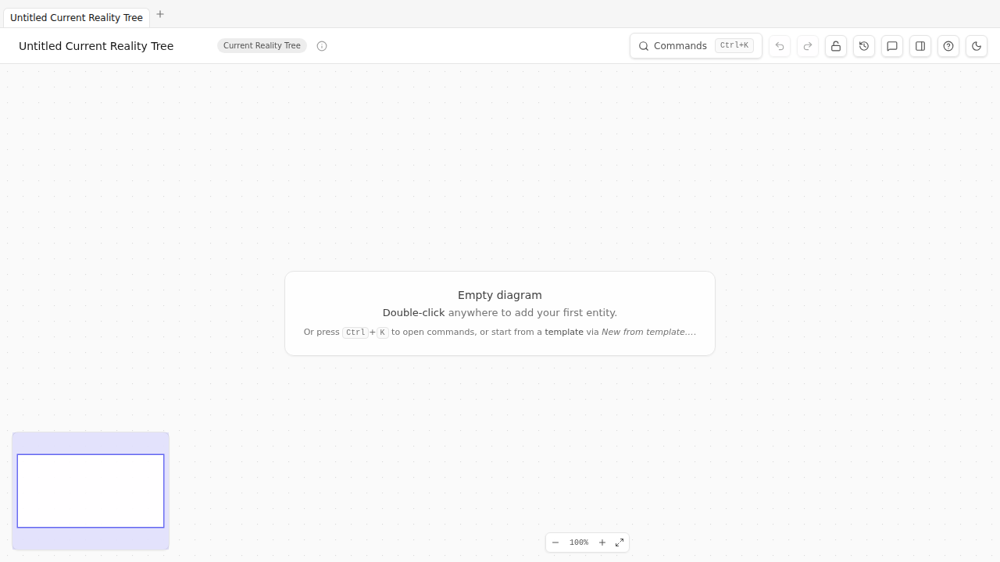
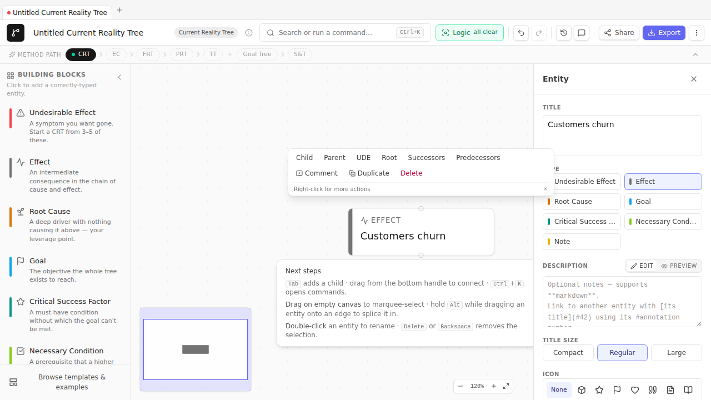
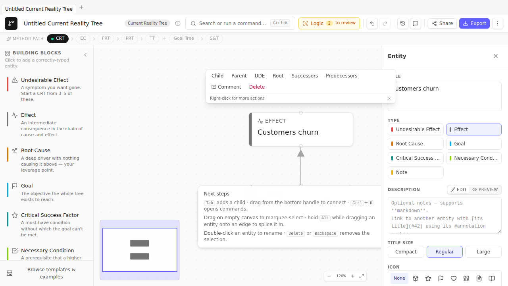

# Chapter 2 — Your first canvas

> *30-minute hands-on. You're going to open TP Studio, create an entity, connect two of them, and inspect the result. No method content here — pure orientation to the surface so the rest of the book can reference TopBar buttons and palette commands by name without you stopping to look them up.*

## Opening the application

TP Studio runs in a browser tab. Three ways in:

- **The hosted PWA** at <https://tp-studio.struktureretsundfornuft.dk/>. Works offline after first visit; nothing leaves your machine.
- **A local dev server** if you cloned the repo: `pnpm dev`, then open the URL it prints (usually `http://localhost:5173`).
- **A local preview** of the built bundle: `pnpm preview` after `pnpm build`.

Pick the hosted PWA if you're a reader rather than a contributor. The app is identical either way.

The first time you load TP Studio you'll see an empty canvas with a centered hint:

> **Empty diagram**
> Double-click anywhere to add your first entity.

Your work auto-saves to this browser on every change. Closing the tab and reopening it picks up where you left off. No sign-in, no cloud, no upload — your diagrams live in this browser's `localStorage` and nowhere else. (Sharing with others is a separate step covered in [Chapter 16](16-sharing-your-work.md).)

## What's on screen

| Element | Where | What it does |
| --- | --- | --- |
| **Title** | Top-left | Click to rename the document. A small `CRT` / `FRT` / `EC` / etc. badge next to it shows the diagram type. |
| **Commands button** | Top-right | Opens the command palette. Same as `Cmd/Ctrl+K`. |
| **Lock button** | Top-right | Toggles Browse Lock — read-only mode. Use it before screen-sharing or demoing. |
| **History button** | Top-right (sm+ screens) | Toggles the Revision Panel slide-in. |
| **Help button (?)** | Top-right | Opens the keyboard-shortcuts dialog. |
| **Theme toggle** | Top-right | Light ↔ dark. (High-contrast variants live in Settings.) |
| **Canvas** | Center | The infinite dot-grid where your diagram lives. Pan with middle-click drag or two-finger scroll; zoom with the wheel or `+` / `-`. |
| **Zoom controls** | Bottom-left | Zoom in, zoom out, fit-to-view. |
| **Minimap** | Bottom-right (when enabled in Settings) | An overview with a viewport indicator. |
| **Inspector** | Right panel | Slides in when you select an entity or edge. Holds title, type, description, attestation, span-of-control, attributes, and warnings. |
| **Toaster** | Bottom-center | Brief confirmations: "Saved", "Loaded example CRT", "3 open CLR concerns". |

## Creating your first entity

Double-click the empty canvas anywhere. A blank node appears with the title field already focused. Type a short phrase — a noun-phrase describing something true about your system — and press Enter.

For this walk-through, type: **Customers churn**

Press Enter. The entity commits. You should see this:

That's an entity. By default it's an `effect` type — neutral grey stripe. The type tells you what role this node plays in the causal model; we'll get into types in [Chapter 4](04-current-reality-tree.md).

Click the entity to select it. The Inspector slides in from the right with everything about this entity laid out: title, type grid, description, the rest. Try changing the type to `Undesirable Effect` by clicking the red-striped tile in the Inspector's Type grid. Notice the entity's stripe colour change on the canvas.

## Connecting two entities

Double-click the canvas somewhere below the first entity. Type **Resolution time exceeds 8h** and press Enter. You now have two entities, side by side.

To connect them: hover your mouse near the bottom of an entity — small handle dots appear on the top and bottom edges. Click and drag from the bottom handle of "Resolution time exceeds 8h" up onto "Customers churn". Release. An arrow appears.

Or — faster — select "Resolution time exceeds 8h" by clicking it, then `Alt+click` "Customers churn". TP Studio interprets Alt-click as "connect from current selection to clicked node".

Your canvas now looks like this:

Read the arrow aloud: *"Resolution time exceeds 8h" causes "Customers churn".* That's the CRT reading convention — bottom-up, cause to effect, `because` linking the upper to the lower. (FRT, EC, PRT, and TT each have their own conventions; we cover them in [Chapter 3](03-reading-a-diagram.md).)

## The command palette

`Cmd+K` (Mac) or `Ctrl+K` (Windows / Linux) opens the command palette — the canonical way to do anything in TP Studio that isn't a direct canvas gesture. Try it now. You'll see a search box and a list of commands grouped by category: File, Edit, Diagram, Layout, Export, Settings.

Type **Help** to filter. The top result is "Show keyboard shortcuts". Press Enter to open the Help dialog — that's the reference for every shortcut the application exposes.

A few commands worth memorizing today:

| Type into palette | What it does |
| --- | --- |
| `New diagram` | Open the picker for fresh CRT / FRT / PRT / TT / EC / Goal Tree / S&T / Freeform docs. |
| `Load example` | Open the picker for canned example docs in every diagram type. |
| `New from template` | Open the curated templates library (10 specs covering Goal Trees / ECs / CRTs). |
| `Export` | Open the unified Export Picker (PNG / SVG / JPEG / PDF / Markdown / OPML / DOT / Mermaid / VGL / Flying Logic XML). |
| `Capture snapshot` | Save a revision; the History panel will then let you compare or restore. |
| `Copy read-only share link` | Generate a URL that encodes the entire doc and load it elsewhere in read-only mode. |
| `Show keyboard shortcuts` | The full key reference. |

## Saving, exporting, sharing — the one-paragraph version

You don't save. TP Studio saves continuously to localStorage. Close the tab; reopen; your work is there.

You export by opening the Export picker (`Cmd+K → Export`). The picker shows everything in three groups: Images (PNG / SVG / JPEG / PDF / print preview), Markup (Markdown / OPML / DOT / Mermaid / VGL / Flying Logic XML), and Workshop (one-page EC sheet PDF, standalone HTML viewer, JSON, reasoning narrative / outline).

You share by either:
- Exporting the standalone HTML viewer (one file, no network, open by double-clicking on any machine); or
- Generating a read-only share link (`Cmd+K → Copy read-only share link`) — a URL that contains the whole doc encoded into its fragment.

Sharing is fully covered in [Chapter 16](16-sharing-your-work.md).

## Try it

Five minutes. No reading.

1. Create three entities with double-click. Give them placeholder titles ("A", "B", "C" is fine).
2. Connect A → B → C using Alt+click.
3. Open the Inspector for B and change its type to `Root Cause`. Watch the stripe colour change.
4. Press `Cmd+K → Capture snapshot`. Name the revision "After type change".
5. Delete C. Notice the toast at the bottom.
6. Press `Cmd+Z` to undo. C comes back.
7. Open the History panel (TopBar history button on `sm+` screens, or `Cmd+K → Open history panel`). You'll see your "After type change" snapshot.

You now know more about the surface than you can remember reading. That's the point of the chapter.

## Where this lives in the rest of the book

- Diagram-type-specific instructions live in the relevant Part 2 chapter (CRT in 4, EC in 5, etc.).
- Notation conventions live in [Chapter 3](03-reading-a-diagram.md).
- The CLR validators are [Chapter 13](13-the-clr.md).
- Revisions and side-by-side compare are [Chapter 14](14-iteration-revisions-branches.md).
- Exports, share links, and prints are [Chapter 16](16-sharing-your-work.md).
- Every keyboard shortcut is in [Appendix B](appendix-b-keyboard-reference.md).
- Every Settings toggle is in [Appendix D](appendix-d-settings.md).

🔁 **Chain to next:** you can drive the surface. Next you need to be able to *read* what you draw on it.

---

→ Continue to [Chapter 3 — Reading a diagram](03-reading-a-diagram.md)
