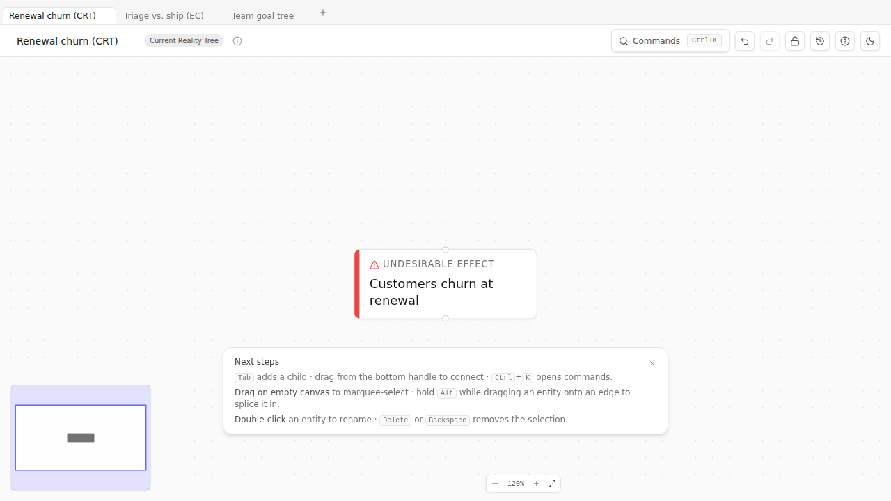
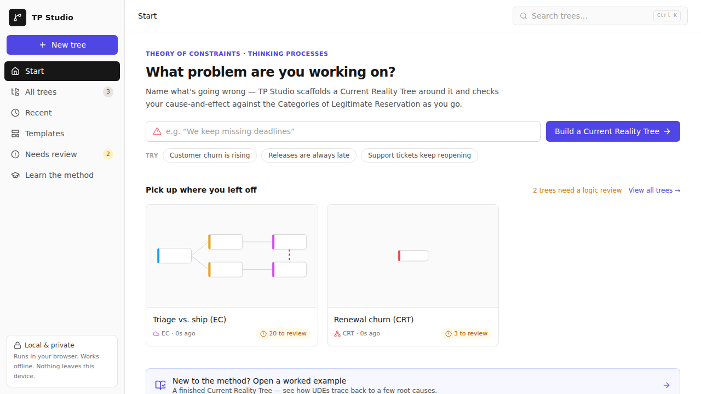

# Chapter 2 — Your first canvas

> *30-minute hands-on. You're going to open TP Studio, create an entity, connect two of them, and inspect the result. No method content here — pure orientation to the surface so the rest of the book can reference TopBar buttons and palette commands by name without you stopping to look them up.*

## Opening the application

TP Studio runs in a browser tab. Three ways in:

- **The hosted PWA** at <https://tp-studio.struktureretsundfornuft.dk/>. Works offline after first visit; nothing leaves your machine.
- **A local dev server** if you cloned the repo: `pnpm dev`, then open the URL it prints (usually `http://localhost:5173`).
- **A local preview** of the built bundle: `pnpm preview` after `pnpm build`.

Pick the hosted PWA if you're a reader rather than a contributor. The app is identical either way.

**Updates.** When a new version of TP Studio ships, a small "New version available — Refresh now" toast appears at the bottom of the canvas; click it to apply. The flow is explicit on purpose: silent reloads while you're mid-edit would be hostile. If you want to check on demand (e.g. after a known release), `Cmd/Ctrl+K → Check for updates` forces the service worker to look — it tells you either *"You're on the latest version of TP Studio"* (green) or surfaces the refresh prompt for a new build (info).

TP Studio opens on the **Start** page — a workspace that names a problem for you, lists your trees, and offers templates (covered in [The Start page](#the-start-page--your-workspace-home) below). Building or opening a tree from there drops you onto the canvas. A brand-new tree is an empty canvas with a centered hint:

> **Empty diagram**
> Double-click anywhere to add your first entity.

Your work auto-saves to this browser on every change. Closing the tab keeps the tree in the library (the Start page's "All trees"); reopening the app picks up where you left off. No sign-in, no cloud, no upload — your diagrams live in this browser's `localStorage` and nowhere else. (Sharing with others is a separate step covered in [Chapter 16](16-sharing-your-work.md).)

## What's on screen

| Element | Where | What it does |
| --- | --- | --- |
| **Home / logo** | Top-left | The TP Studio mark. Opens the **Start** workspace — your trees, the templates, and the problem-led "build a CRT" hero (see below). |
| **Title + type badge** | Top-left | Click the title to rename. A `CRT` / `FRT` / `EC` / etc. badge shows the diagram type; the small ⓘ icon opens the Document Inspector. |
| **Command search** | Top-center | Click it (or press `Cmd/Ctrl+K`) to open the command palette. |
| **Building Blocks rail** | Left edge | Type-led entity creation for the current diagram — click a block to drop that entity at the canvas centre. Collapsible. |
| **Method path** | Strip under the top bar | Where the active diagram sits in the TP sequence (CRT → EC → FRT → PRT → TT, plus the Goal / S&T branch), with a suggested next step. **Collapsible** — hide it with its chevron, reopen from the ⋮ menu. |
| **Logic check chip** | Top-right | Emerald **"all clear"** or amber **"N to review"** — opens the CLR (Categories of Legitimate Reservation) panel. |
| **Undo / Redo · History · Comments** | Top-right | Step through edits; the Revision panel; review comments. |
| **Share · Export** | Top-right | Copy a read-only share link; open the unified Export picker. |
| **Overflow (⋮)** | Top-right | Theme, Browse Lock, Help, the layout-mode toggle, and **Show / Hide method path**. |
| **Canvas** | Center | The infinite dot-grid where your diagram lives. Pan with middle-click drag or two-finger scroll; zoom with the wheel or `+` / `-`. |
| **Zoom controls** | Bottom | Zoom in, zoom out, fit-to-view. |
| **Inspector** | Right panel | Slides in when you select an entity or edge — title, type, description, attributes, and warnings. Shares the dock with the Logic-check panel. |
| **Toaster** | Bottom-center | Brief confirmations: "Saved", "Loaded example CRT", "3 open CLR concerns". |

## Creating your first entity

Double-click the empty canvas anywhere. A blank node appears with the title field already focused. Type a short phrase — a noun-phrase describing something true about your system — and press Enter.

For this walk-through, type: **Customers churn**

Press Enter. The entity commits. You should see this:

That's an entity. By default it's an `effect` type — neutral grey stripe. The type tells you what role this node plays in the causal model; we'll get into types in [Chapter 4](04-current-reality-tree.md).

Click the entity to select it. The Inspector slides in from the right with everything about this entity laid out: title, type grid, description, the rest. Try changing the type to `Undesirable Effect` by clicking the red-striped tile in the Inspector's Type grid. Notice the entity's stripe colour change on the canvas.

## Connecting two entities

Double-click the canvas somewhere below the first entity. Type **Resolution time exceeds 8h** and press Enter. You now have two entities, side by side.

To connect them: hover your mouse near the bottom of an entity — small handle dots appear on the top and bottom edges. Click and drag from the bottom handle of "Resolution time exceeds 8h" up onto "Customers churn". Release. An arrow appears.

Or — faster — select "Resolution time exceeds 8h" by clicking it, then `Alt+click` "Customers churn". TP Studio interprets Alt-click as "connect from current selection to clicked node".

Your canvas now looks like this:

Read the arrow aloud: *"Resolution time exceeds 8h" causes "Customers churn".* That's the CRT reading convention — bottom-up, cause to effect, `because` linking the upper to the lower. (FRT, EC, PRT, and TT each have their own conventions; we cover them in [Chapter 3](03-reading-a-diagram.md).)

## The command palette

`Cmd+K` (Mac) or `Ctrl+K` (Windows / Linux) opens the command palette — the canonical way to do anything in TP Studio that isn't a direct canvas gesture. Try it now. You'll see a search box and a list of commands grouped by category: File, Edit, View, Review, Export, Help. Your five most-recent commands pin to the top in a Recent group.

Type **Help** to filter. The top result is "Show keyboard shortcuts". Press Enter to open the Help dialog — that's the reference for every shortcut the application exposes.

A few commands worth memorizing today:

| Type into palette | What it does |
| --- | --- |
| `New diagram` | Open the picker for fresh CRT / FRT / PRT / TT / EC / Goal Tree / S&T / Freeform docs. |
| `Load example` | Open the picker for canned example docs in every diagram type. |
| `New from template` | Open the curated templates library (10 specs covering Goal Trees / ECs / CRTs). |
| `Export` | Open the unified Export Picker (PNG / SVG / JPEG / PDF / Markdown / OPML / DOT / Mermaid / VGL / Flying Logic XML). |
| `Capture snapshot` | Save a revision; the History panel will then let you compare or restore. |
| `Copy read-only share link` | Generate a URL that encodes the entire doc and load it elsewhere in read-only mode. |
| `Show keyboard shortcuts` | The full key reference. |

## Working with multiple documents

TP Studio keeps several documents open at once, each in its own **tab** along the top of the canvas. Click a tab to switch; click the **+** to open a fresh CRT; hover a tab and click **✕** to close it; drag a tab to reorder. Closing the last tab leaves a new blank one — there is never zero.

Each tab is independent: its own undo history, autosave, and share link. Reloading the browser restores *every* open tab, not just the active one.

Opening a document — an import, a pattern, a template, an example, a shared link, or an Evaporating Cloud spawned from a conflict — opens it in a *new* tab by default, leaving your current work in place. Prefer the old "replace what's open" behaviour? Turn off **Settings → Behavior → "Open documents in new tabs"** ([Appendix D](appendix-d-settings.md)).

The palette (`Cmd/Ctrl+K`) carries **New / Duplicate / Close / Next / Previous tab** and **Forget closed documents** (reclaims storage from closed docs). Installed as an app, the native **`Cmd/Ctrl+T` / `+W` / `+1`–`9`** keys work too ([Appendix B](appendix-b-keyboard-reference.md)).

## The Start page — your workspace home

TP Studio **opens on the Start page**: a full-screen workspace that sits in front of the editor, with a persistent left sidebar whose nav drives the main area. The **logo** (top-left) returns you to it any time.

- **Start** — a problem-led hero. Type what's going wrong (*"We keep missing deadlines"*) and **Build a Current Reality Tree** mints a fresh CRT with that statement as its first UDE — no blank canvas. Example chips do the same in one click; a worked-example callout opens a finished CRT to learn from; and a strip of templates sits beneath. Once you have work in progress, a **"Pick up where you left off"** row shows your most-recent trees with their logic status.
- **All trees / Recent** — every tree you've made as a card (a mini preview + title + type + when you last edited it) or a compact list. **Closing a tab keeps the tree here** — "All trees" is a library of every tree, not just the open tabs; hover a card and click the trash icon to delete one for good. Each card carries a **Logic pill**: emerald *"Logic clear"* or amber *"N to review"*, reading the exact same Categories-of-Legitimate-Reservation check the editor's Logic chip uses — so a card can never disagree with the canvas.
- **Templates** — the full template library, grouped by diagram type (Goal Trees, Evaporating Clouds, CRTs, …). Click a card to load it into a new tab.
- **Needs review** — just the trees with at least one open reservation. This is the CLR as triage: open the workspace, see which trees still have logic to resolve, and click straight in.
- **Learn the method** — the User Guide, the keyboard reference, and this book.

Clicking any tree card, template, or the **Build** button drops you straight into the editor on that document; **New tree** (top of the sidebar) opens the diagram-type picker. Trees stay in the library until you delete them — `Cmd/Ctrl+K → Forget closed documents` clears the closed ones in bulk.

## Saving, exporting, sharing — the one-paragraph version

You don't save. TP Studio saves continuously to localStorage. Close the tab; reopen; your work is there.

You export by opening the Export picker (`Cmd+K → Export`). The picker shows everything in three groups: Images (PNG / SVG / JPEG / PDF / print preview), Markup (Markdown / OPML / DOT / Mermaid / VGL / Flying Logic XML), and Workshop (one-page EC sheet PDF, standalone HTML viewer, JSON, reasoning narrative / outline).

You share by either:
- Exporting the standalone HTML viewer (one file, no network, open by double-clicking on any machine); or
- Generating a read-only share link (`Cmd+K → Copy read-only share link`) — a URL that contains the whole doc encoded into its fragment.

Sharing is fully covered in [Chapter 16](16-sharing-your-work.md).

## Try it

Five minutes. No reading.

1. Create three entities with double-click. Give them placeholder titles ("A", "B", "C" is fine).
2. Connect A → B → C using Alt+click.
3. Open the Inspector for B and change its type to `Root Cause`. Watch the stripe colour change.
4. Press `Cmd+K → Capture snapshot`. Name the revision "After type change".
5. Delete C. Notice the toast at the bottom.
6. Press `Cmd+Z` to undo. C comes back.
7. Open the History panel (TopBar history button on `sm+` screens, or `Cmd+K → Open history panel`). You'll see your "After type change" snapshot.

You now know more about the surface than you can remember reading. That's the point of the chapter.

## Starting from a real problem (not a blank canvas)

The hardest moment in any analysis is the empty canvas with a vague problem behind it. You don't have to start by drawing. Match your starting state to the on-ramp:

| You have… | Start with | How |
| --- | --- | --- |
| A problem you can name in a sentence | **The Start hero** | Click the logo, type the problem, **Build a Current Reality Tree**. Your sentence becomes the tree's first UDE — you're on a populated canvas immediately. |
| A vague mess, no idea where to begin | **Rapid 3-cloud diagnosis** | `Cmd+K → Rapid 3-cloud diagnosis…`. Name three symptoms and the tug-of-war behind each; it consolidates them into one Core Cloud to work from. |
| A brain-dump, meeting notes, a bulleted list | **Quick Capture** | Press `E` (outside a text field). Paste the indented list; each line becomes an entity, indentation becomes causal nesting. |
| A spreadsheet of items | **CSV import** | `Cmd+K → Import… → Entities CSV`. A `title,type,parent_title` header maps rows to entities and edges. |
| A sense that "someone's drawn this shape before" | **Templates / Pattern library** | `Cmd+K → New from template…` for the curated set, or `Pattern library…` for the broader catalogue (system archetypes, domain CRTs, the classic clouds). Load one, edit it into your situation. |
| A problem you can *describe* but not draw | **The AI skill** | Describe it to Claude via the `tp-studio-import` skill — "*a CRT for why onboarding churns*" — and import the `.json` it produces ([Chapter 16](16-sharing-your-work.md)). Treat it as a first draft to scrutinise, not an answer. |

All five drop you onto a populated canvas with *something* to react to — and reacting is far easier than creating from nothing. From there it's the same loop: read it aloud, scrutinise the arrows, restructure, repeat.

## Where this lives in the rest of the book

- Diagram-type-specific instructions live in the relevant Part 2 chapter (CRT in 4, EC in 5, etc.).
- Notation conventions live in [Chapter 3](03-reading-a-diagram.md).
- The CLR validators are [Chapter 13](13-the-clr.md).
- Revisions and side-by-side compare are [Chapter 14](14-iteration-revisions-branches.md).
- Exports, share links, and prints are [Chapter 16](16-sharing-your-work.md).
- Every keyboard shortcut is in [Appendix B](appendix-b-keyboard-reference.md).
- Every Settings toggle is in [Appendix D](appendix-d-settings.md).

🔁 **Chain to next:** you can drive the surface. Next you need to be able to *read* what you draw on it.

---

→ Continue to [Chapter 3 — Reading a diagram](03-reading-a-diagram.md)
