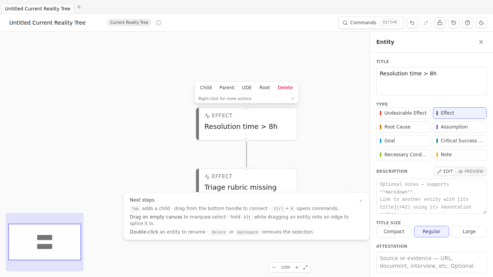

# Chapter 3 — Reading a diagram

> *The notation chapter. Nothing here is original to TOC — these are the conventions Goldratt's tradition has settled on over forty years. The chapter is short because it's reference-shaped: come back to it whenever a later chapter says something like "necessity edge" or "AND junctor" and you need a quick refresher.*

## Causality flows up (mostly)

In Current Reality Trees and Future Reality Trees, **causality flows from bottom to top**. Causes sit below; effects sit above. An arrow points *from* the cause *to* the effect. Read aloud: *"Because [cause], [effect]."* Or equivalently: *"[Cause] therefore [effect]."*

In Prerequisite Trees, Transition Trees, and Evaporating Clouds, the orientation is different — covered chapter-by-chapter. The point worth knowing now: **TP Studio respects per-diagram orientation conventions automatically.** When you load a CRT, dagre lays it out bottom-up. When you load a PRT, dagre lays it top-down. When you load an EC, you get a hand-positioned 5-box layout. Don't fight the convention; the convention is what makes the diagram *readable* to other practitioners.

## Causality reading mode

The most common confusion when first encountering a CRT is "do I read up or down?" Goldratt's tradition says read up: *"because A, B; because B, C."*  Some practitioners prefer the dual: *"A, therefore B; B, therefore C."* Both are valid.

TP Studio lets you pick a global default in **Settings → Display → Causality reading**:

| Mode | What it does |
| --- | --- |
| `none` | No fallback label on edges. Best for clean exports. |
| `because` | Renders a muted italic "because" on each unlabeled edge. Reads bottom-up. |
| `therefore` | Renders a muted italic "therefore" on each unlabeled edge. Reads top-down. |
| `auto` *(default)* | Picks per-diagram: `because` for CRT / FRT / TT; `in order to` for PRT / EC; nothing for freeform / S&T. |



Per-edge labels always override the global fallback. If you've explicitly labeled an edge — say, "because the SLA target is 8h" — the fallback word disappears and your label renders instead. Aggregated edges (those representing several edges collapsed across a group boundary) skip the fallback too; their `×N` count badge is the more informative thing.

## Sufficiency vs. necessity

The most consequential distinction in TOC notation, and the one most easily fudged.

**Sufficient cause:** the cause, by itself, produces the effect. *"Because A, B"* — A alone is enough. CRT and FRT edges are sufficient causes.

**Necessary condition:** the effect *requires* the cause; without the cause, the effect can't happen — but the cause alone is not enough. *"In order to obtain B, we must have A"* — A is required, but other things might also be required. EC and PRT edges are necessity edges.

TP Studio's v7 schema makes the distinction explicit. Each edge has `kind: 'sufficiency' | 'necessity'`, set per-diagram-type by default. You can override per-edge in the Edge Inspector when you have a mixed-causality diagram.

The verbaliser uses this field to choose between "because" / "therefore" wording and "in order to" / "we must" wording. The CLR validators use it too: a *Predicted Effect Existence* check fires only on sufficiency claims, because "if A is true, B should also be true *somewhere we can see*" is a sufficient-cause prediction.

## Edge polarity

TOC extended the notation in the 1990s to support **polarity** — does this cause *increase* or *decrease* the effect? Three values, plus a default:

| Polarity | Visual | Meaning |
| --- | --- | --- |
| `positive` *(default)* | Plain arrow, no badge | "More of A → more of B." The classic sufficient-cause arrow. |
| `negative` | Arrow with a rose `−` badge | "More of A → less of B." A is a *reducer*. |
| `zero` | Arrow with a neutral `∅` badge | "A is flagged as non-influential here." Common in iterated FRTs where a previously-suspected cause has been ruled out. |

Polarity is set via the Edge Inspector's Polarity picker or by cycling on the selected edge with the `cycle-edge-polarity` palette command. The cycle order is default → positive → negative → zero → default.

Polarity matters mostly in FRTs and S&T trees, where the question "will this injection actually move the needle?" hinges on whether the chain is all-positive (good), mixed (worth thinking), or contains a negative downstream of your lever (problem).

## AND / OR / XOR junctors

A causal arrow on its own claims *sufficiency*: the cause produces the effect. But many real causal patterns aren't single-arrow — they involve *combinations*.

TP Studio renders three kinds of combinatorial junctor, all sharing the same visual machinery (a small circle just below the target node) with different labels and colors:

| Junctor | Visual | Logical meaning |
| --- | --- | --- |
| **AND** | Violet circle labeled `AND` | All inbound causes must be present for the effect to occur. The set is jointly sufficient; no individual is. |
| **OR** | Indigo circle labeled `OR` | Any one of the inbound causes is sufficient. The set is alternative. |
| **XOR** | Rose circle labeled `XOR` | Exactly one of the inbound causes occurs; mutually exclusive alternatives. |

To group edges into a junctor: select the edges (use shift-click for multi-select), then `Cmd+K → Group as AND` (or `OR` / `XOR`). The selected edges are rewired through a single junctor circle just below the target node, with one short outgoing arrow from junctor up into the target.

Cross-kind exclusivity: an edge belongs to at most one junctor kind. If you group an AND-grouped edge into an OR, the AND group dissolves first.

You'll mostly use AND. It's the conjunctive that makes a CRT honest: if "Customers churn" requires BOTH "Resolution time > 8h" AND "Onboarding is poorly documented", saying "either causes churn" is overstating the strength of each. The AND junctor forces you to be honest about which combinations are sufficient.

## Back-edges

Sometimes a diagram has a real cycle. Customers churning *causes* lower retention metrics, which *cause* leadership pressure on the support team, which *causes* deferred refactors, which *causes* the original "resolution time exceeds 8h", which *causes* churn. Round and round.

TP Studio supports flagging an edge as a **back-edge** — a deliberate loop-closer the practitioner has acknowledged as part of the structure, rather than a CLR bug. Back-edges render with a thicker dashed stroke and a small `↻` glyph mid-edge. The cycle CLR validator suppresses its warning for any cycle whose closing edge is back-tagged.

To tag: select the edge, Inspector → Back-edge toggle. Or right-click → "Toggle back-edge".

Most diagrams don't need back-edges. Use them when the structure is genuinely a positive or negative *reinforcing loop* (Senge's term) — a feedback structure you want to study, not a CRT cycle you accidentally drew.

## Mutex (EC-only)

In an Evaporating Cloud, the two "Want" entities (D and D′) are *in conflict*. The whole point of the diagram is that you've identified a tension between two real, legitimate wants — they pull you in opposite directions.

TP Studio represents this conflict with a **mutex edge** between D and D′: rendered red with a lightning-bolt (⚡) glyph in the middle. It's the only edge in the diagram that's bidirectional in meaning ("they conflict" rather than "A causes B").

The `ec-missing-conflict` validator fires on any EC document until at least one want↔want edge is flagged as `isMutualExclusion`. Tag it via Edge Inspector → Mutual exclusion, or right-click → Toggle mutual exclusion.

## Span-of-control

A second extension Goldratt added: each entity carries a **span-of-control** flag indicating who controls it.

| Span | Visual | Meaning |
| --- | --- | --- |
| `control` | Emerald `C` pill | Inside your control. You can directly change this. |
| `influence` | Amber `I` pill | Outside your direct control, but you can plausibly influence. Vendors, neighboring teams, customers via product changes. |
| `external` | Neutral `E` pill | Outside your control AND your influence. Macro conditions, regulation, market forces. |

Why it matters: **the constraint you want to find lives in your control or influence zone**, not in the external zone. The `external-root-cause` CLR validator fires on root causes flagged `external` — the diagram tells you you've found a "cause" that you can't actually do anything about, which usually means you've stopped one step short of the real root cause.

Set via Entity Inspector → Span of Control, or right-click → Set span of control.

## The CLR — a one-paragraph preview

Six "Categories of Legitimate Reservation" — the discipline checks Goldratt taught for evaluating someone else's causal claim. TP Studio surfaces them automatically as **warnings** in the Inspector's Warnings list. They are not errors; they are reservations a thoughtful colleague would raise if they were reading your diagram over your shoulder. We get into the CLR in depth in [Chapter 13](13-the-clr.md), but for now know that:

- Warnings fire on entities AND edges, depending on what the rule checks.
- Tiers escalate from `clarity` (the most pedagogical) to `predictedEffect` (the most architectural).
- You can dismiss warnings explicitly when you've considered the reservation and decided it doesn't apply.
- The `Start CLR walkthrough` palette command iterates all open warnings one at a time with Resolve / Open-in-inspector actions.

## Quick reference card

Print this and tape it next to your monitor:

```
CRT / FRT       — causality flows up.    "Because [below], [above]."
PRT             — IO → obstacle.          "To get [above], must overcome [below]."
TT              — action + precondition.  "Do [action] given [precondition] to obtain [outcome]."
EC              — 5 boxes in fixed layout. Read aloud per Chapter 5.
Goal Tree       — Goal → CSFs → NCs.      Top-down decomposition.
S&T             — 5-facet cards.          Top-down strategic deployment.

Edge polarity:  default • positive • negative (−) • zero (∅)
Junctors:       AND (violet) • OR (indigo) • XOR (rose)
Back-edge:      thick dashed + ↻ glyph
Mutex (EC):     red + ⚡ glyph
Span-of-ctrl:   C (emerald) • I (amber) • E (neutral)
```

🔁 **Chain to next:** you can read what's on the canvas. Now build one from scratch.

---

→ Continue to [Chapter 4 — Current Reality Tree](04-current-reality-tree.md)
