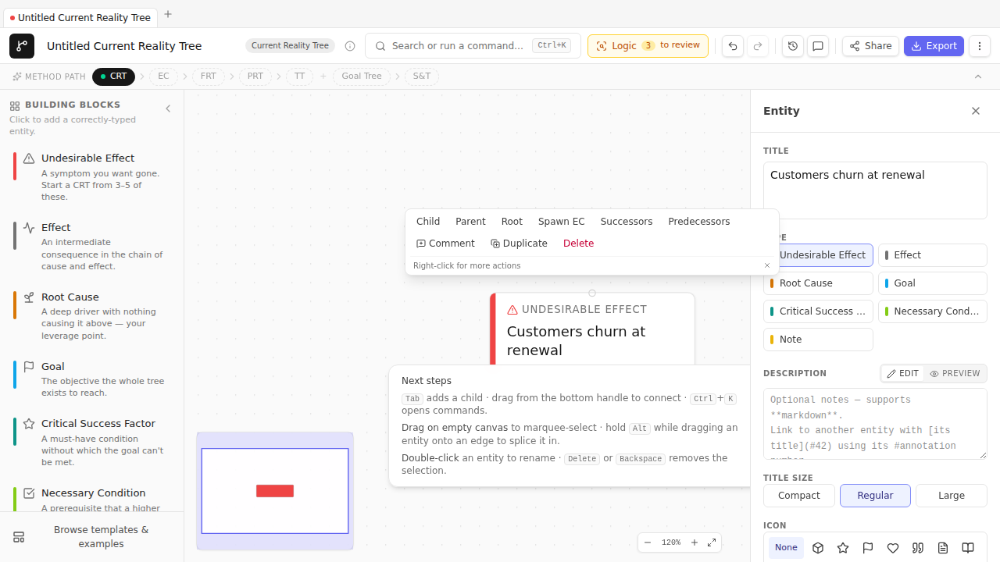
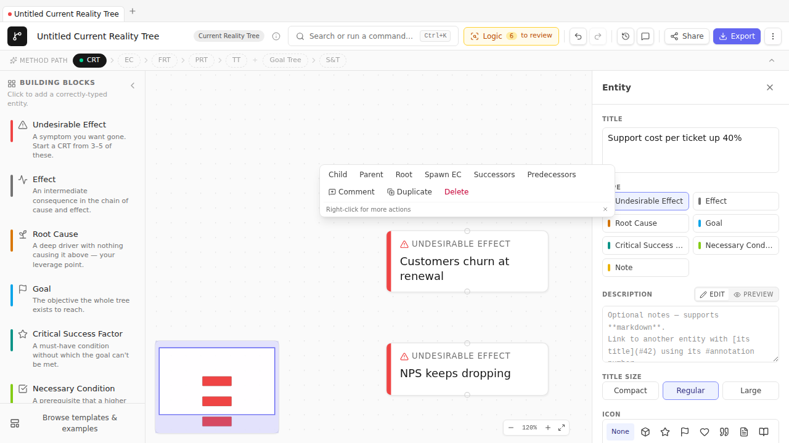

# Chapter 4 — Current Reality Tree
### *Why is this happening?*

> **🎯 What this process is for**
> A Current Reality Tree (CRT) traces a system's painful symptoms — the *Undesirable Effects* — back to their underlying cause. It answers: "Why is the system producing this?" Done well, it identifies the **core driver** — the single root cause whose dismantling would eliminate most of the symptoms. That's the constraint.

## The premise

The CRT is the first Thinking Process you reach for, almost every time. It's the *diagnosis*. You don't fix anything by drawing a CRT — fixing happens later, in the Future Reality Tree and Transition Tree. But you can't fix what you can't see; the CRT is what you see *with*.

The premise that makes CRTs work is the one we set up in [Chapter 1](01-the-system-has-a-goal.md): every system's underperformance traces to one constraint. Most of what looks like multiple problems is one problem in different costumes. The CRT's job is to reveal that the multiple-symptom appearance is illusory and the underlying cause is singular.

When this premise holds, a CRT for a system with 7-10 visible UDEs typically resolves down to 2-4 root causes, with one of them feeding 70-80% of the UDEs by reach. That last one is the core driver. (If your CRT has 7 UDEs all tracing back to 7 independent root causes, you either drew it wrong or — rarely — you're looking at a genuinely young, small system that hasn't yet accumulated structural pathology. In the latter case, congratulations.)

## The method, neutral of tool

1. **List the UDEs.** Talk to the people closest to the system. Ask: "What does this system do that you wish it didn't?" Aim for 5-12 noun-phrases, each describing a single observable effect. ("Customers churn." "Support cost per ticket is up 40%.") Avoid causes ("Because we don't have a triage rubric…") — those go in later.
2. **Pick one UDE and ask why.** For each cause-candidate, ask: "Is this present because of something else?" — and add that something else as a node below. Connect them with a sufficiency arrow upward.
3. **Repeat for every UDE.** Most causes will recur across UDEs — that's the structure you want. A cause that doesn't recur is suspicious; either it's specific to one UDE (which is rare in a real system) or you're stopping too shallow.
4. **Identify converging cause-chains.** When two UDEs trace back through different intermediate effects to the *same* root cause, you've found a structural pattern. Mark it. The convergence is the constraint becoming visible.
5. **Find the core driver.** The root cause with the highest *reach* — the most UDEs it ladders up to — is the candidate. TP Studio's `Find core driver(s)` palette command does this calculation explicitly.
6. **Verbalize.** Read each cause chain aloud, edge by edge. "Because A, B. Because B, C." If a sentence sounds wrong, the diagram is wrong. Fix the diagram.
7. **Stop when the root cause is in your control or influence.** If you bottom out at a cause you flag `external` (the geopolitical situation, the macroeconomy, the customer's mood), keep going one level — there's almost always a `control`-level cause beneath an `external` one. The system you're analyzing belongs to *you*, not the macroeconomy.

## The worked example

We'll build a CRT for a fictional but realistic problem: **a B2B SaaS support team chronically firefighting**.

The setup: VP of Customer Success calls you in. "We're losing customers. Support is burnt out. Cost per ticket is up. We've tried hiring more agents and it didn't help. We've tried better tooling and it didn't help. What's actually going on?"

Three UDEs to start. You write them down in TP Studio.

> **Scope before you draw.** Open a fresh CRT with an empty System Scope and TP Studio drops a one-time toast pointing you to the Document Inspector's **System Scope** section — Goldratt's Step 1 (name the system, its boundary, its measures) *before* the effects. Fill any answer and the nudge is satisfied for that document; dismiss it and it won't return. We jump straight to the UDEs to keep the example moving, but in real work, scope first.

### Step 1 — The first UDE

Open TP Studio. `Cmd+K → New diagram → Current Reality Tree`. Empty CRT canvas opens.

Double-click the canvas, type **Customers churn at renewal**, press Enter. Click the entity to select it. In the Inspector's Type grid, click **Undesirable Effect**. The stripe turns red.

### Step 2 — The other UDEs

Two more double-clicks. Type **NPS keeps dropping** for one, **Support cost per ticket up 40%** for the other. Mark both as `Undesirable Effect` via the Inspector. Three red-striped entities side by side:

🛠 **How TP Studio helps:** The TopBar's TitleBadge will now say "CRT" — confirming the diagram-type-appropriate validators are active. The CLR walkthrough wizard (`Cmd+K → Start CLR walkthrough`) will already be flagging "UDEs without cause chains" as a clarity-tier warning. We'll get to those.

### Step 3 — First cause-chain

Pick the most visceral UDE first. "Customers churn at renewal" — why? Because (you ask the team) deals close on the assumption of a 4-hour SLA but support routinely misses it. So: under "Customers churn at renewal", add a new entity titled **Customer SLA expectations are missed**. Connect upward.

Read it: *"Because the customer SLA expectations are missed, customers churn at renewal."* Sounds reasonable.

Why are SLA expectations missed? Because resolution time runs over 8 hours on most tickets. Add **Resolution time > 8h on most tickets**; connect.

Why? Two reasons, you discover after talking to agents. (1) The team has no shared triage rubric — every ticket gets the same level of investigation regardless of severity. (2) Senior agents context-switch constantly between L1 and L2 tickets, so neither gets done quickly.

Add both as causes. These are *jointly* sufficient — you need them both for the long resolution times. Group them as an AND. (Select both edges → `Cmd+K → Group as AND`.)

### Step 4 — The second cause-chain

"NPS keeps dropping" — why? You ask. The biggest detractor theme is "I get a different answer every time I contact you." So: under "NPS keeps dropping", add **Customers get inconsistent answers**.

Why inconsistent? Because — again — no triage rubric. *Same* cause we already added under the other branch. So instead of duplicating it, connect "Customers get inconsistent answers" to the existing **No shared triage rubric** node. The arrow goes up; the node already lives over there.

This is the moment a CRT starts to *feel* like a structural diagnosis. The convergence is the constraint becoming visible.

### Step 5 — The third cause-chain

"Support cost per ticket up 40%" — why? Two reasons emerge in conversation: agents redo prior work because there's no canonical answer to common questions; *and* senior agents are bottlenecked because everything escalates to them (which is the same context-switching problem from the first chain).

Add **Agents redo prior work for common questions**. Why? Because there's no consolidated answer base. Why no answer base? Because nobody's been protected from incoming tickets long enough to build one.

Add **Support lead has no protected drafting time**. Connect upward. Also: the senior-agent context-switching pulls in the same direction. Connect.

You should now have something resembling a tree with three UDEs at the top, converging through intermediate effects into a small number of root causes at the bottom. Click each terminal node and mark it `Root Cause` via the Inspector's Type grid.

### Step 6 — Find the core driver

`Cmd+K → Find core driver(s)`. TP Studio computes UDE-reach for each root cause and selects the top candidate(s). The toast tells you the score: how many UDEs the highest-reach root cause ladders up to.

In our example: **Support lead has no protected drafting time** is reaching all three UDEs (directly or via the chain). That's the core driver. The constraint isn't "we need more agents" or "we need better tooling" — it's that nobody has been protected from incoming work long enough to build the system the team needs.

🛠 **How TP Studio helps:** Settings → Display → Show UDE-reach badge toggles an amber `→N UDEs` pill on each entity. With it on, the core driver visually announces itself in any CRT.

### Step 7 — Verbalize

Click `Cmd+K → Start read-through` to open the walkthrough overlay. TP Studio iterates each structural edge in topological order. Read each sentence aloud.

*"Because Support lead has no protected drafting time, agents redo prior work for common questions."* Sounds right.

*"Because Support lead has no protected drafting time, no shared triage rubric exists."* Sounds right.

*"Because No shared triage rubric AND Senior agents context-switch constantly, resolution time > 8h on most tickets."* Sounds right.

*"Because resolution time > 8h, customer SLA expectations are missed."* Sounds right.

*"Because customer SLA expectations are missed, customers churn at renewal."* Sounds right.

Read each chain twice. The second time you'll catch the one that sounds *almost* right but isn't quite — a CLR tier-3 (cause-effect reversal) or tier-4 (predicted effect existence) violation. Fix it. Re-read.

### Step 8 — Stop

How do you know the CRT is done?

- Every UDE traces to a root cause that's in your `control` or `influence` zone.
- The core driver is identified; its reach feels structurally honest (not "I made one node connect to everything"; really *connecting*).
- Read-aloud passes the gut check on every chain.
- The CLR walkthrough is empty (no open warnings) — or each open warning has been explicitly dismissed with a "considered and doesn't apply" note in the entity's description.

When all four are true, the CRT is ready for the next step — which is usually [Chapter 5](05-evaporating-cloud.md), where you ask why the core driver has persisted.

## Feedback loops, the R/B badge, and system archetypes

A CRT is usually a directed acyclic graph — causes flow upward to effects and stop. But some systems bite back. A cause produces an effect that loops around and *amplifies the original cause*. When that happens, you have a feedback loop, and your CRT has a cycle. TP Studio detects the back-edge closing the cycle, classifies the loop, and tells you what kind of trouble you're in.

### Building the loop — a "Fixes that Fail" example

Return to the support team scenario, and add one more cause chain that the team mentions almost in passing: "Whenever a major ticket causes a production outage, the on-call engineer restarts the affected service. That gets things working again in under ten minutes, so everyone moves on."

Add two new entities: **Production outage occurs** (mark it UDE) and **On-call engineer restarts service**. Connect **Production outage occurs → On-call engineer restarts service** (the immediate response), then connect **On-call engineer restarts service → Root fault goes uninvestigated** (the restart buys time but masks the underlying defect), and finally connect **Root fault goes uninvestigated → Production outage occurs** (the fault persists and triggers the next outage). That last arrow closes the cycle — it is the back-edge.

The moment you draw it, TP Studio decorates that edge with a small badge: **R**. That badge means *Reinforcing*. TP Studio derives it by multiplying the polarities of every edge around the loop — if the product is positive, the loop amplifies whatever is already happening. Here, each restart relieves the outage *and* prevents the fix, so outages accumulate over time. The R badge is the diagram telling you: this loop will not self-correct.

> **R vs B at a glance.** A Reinforcing loop has no governor — it compounds. A Balancing loop has a target it steers toward; it self-corrects (though it may hunt, overshoot, or oscillate with a delay). Neither is inherently good or bad. A B loop can trap a system in a suboptimal equilibrium; an R loop can be the engine of growth or a death spiral. The badge just names what the structure does.

### Running the CLR check for the loop

Open the CLR walkthrough (`Cmd+K → Start CLR walkthrough`). If the loop is recognized, you'll see a **Loop polarity** entry in the clarity tier: *"Loop 'unnamed' is Reinforcing (R). Check whether this escalation is intentional."* That's the validator acknowledging the cycle and confirming its classification. If the loop spans a long chain, the walkthrough also flags any edge whose polarity you haven't explicitly set — because a mismarked polarity silently flips the R/B determination.

### Naming the loop and noting its behaviour over time

Click the back-edge (the arrow from **Root fault goes uninvestigated** back to **Production outage occurs**). The Edge Inspector panel opens on the right. In the **Loop name** field, type `Restart spiral`. In the **Behaviour over time** note field, write: *"Outage frequency and severity escalate over time; each quick restart erodes the team's incentive to invest in a real fix."* These two fields travel with the back-edge — they become the loop's identity in any export or review.

### Marking the delay

The fault doesn't cause the next outage instantly — there's typically a lag of days or weeks before the latent defect degrades enough to fire again. Select the edge from **Root fault goes uninvestigated → Production outage occurs** and toggle **Delayed** in the Inspector. TP Studio renders a `//` glyph on that edge, the conventional delay marker.

Before you mark the delay, the CLR walkthrough may have surfaced a warning: *"A reinforcing loop with no delay would escalate instantly — is a time lag missing?"* That warning goes quiet once a delay is marked. This matters practically: a reinforcing loop with a short delay looks like steady escalation; one with a long delay looks like isolated incidents with no obvious connection. The `//` glyph makes the lag visible to everyone who reads the diagram.

### System-archetype patterns

What you just drew is one of five classical feedback patterns — *system archetypes* — that Peter Senge catalogued in *The Fifth Discipline*. TP Studio ships them as ready-to-load starters in the Pattern library (`Cmd+K → Pattern library → Load archetype`):

- **Fixes that Fail** — a symptomatic fix relieves pressure, masking the root cause, so the problem returns worse. *Counter-intuitive lesson: treat the root cause, not the symptom.*
- **Escalation** — two parties each respond to the other's actions by raising the stakes, amplifying the conflict. *Lesson: change the measure both sides are reacting to.*
- **Shifting the Burden** — a symptomatic solution crowds out investment in the fundamental solution, making the system dependent on the symptom-fix. *Lesson: invest in the fundamental solution before the dependency sets in.*
- **Eroding Goals** — when a gap between goal and performance is closed by lowering the goal rather than raising performance. *Lesson: hold the goal.*
- **Limits to Growth** — a reinforcing growth engine hits a limiting factor that slows and eventually stops growth. *Lesson: lift the limit, not the growth rate.*

Load "Fixes that Fail" as a starting point when your situation smells like the restart spiral above. The loaded archetype drops a pre-wired loop onto the canvas; replace its placeholder labels with your own entities, and the R/B badges and CLR checks carry over automatically.

The support team's restart spiral is a textbook Fixes that Fail: the restart is the symptomatic fix, the outage recurrence is the delayed consequence, and the real fix — a mandatory post-incident root-cause investigation protected from the next incoming ticket — is the fundamental solution that never gets funded because the restarts keep the pain just bearable enough to defer it. Sound familiar?

## Sidebars

> **🛠 How TP Studio helps**
> - `Cmd+K → New Current Reality Tree` to start a fresh CRT.
> - `Cmd+K → Load example Current Reality Tree` for a 6-entity reference doc to study before drawing your own.
> - **Inspector Type grid** with one-click switching between Effect / UDE / Root Cause / Assumption.
> - **AND grouping**: select multiple edges → `Cmd+K → Group as AND` (or right-click → Group as AND).
> - **`Find core driver(s)`** palette command — picks the highest-reach root cause(s).
> - **UDE-reach badge** (Settings → Display → "Show UDE-reach badge") visualizes reach per entity.
> - **Reverse-reach badge** shows the symmetric "root causes per UDE" count, useful for verifying that each UDE has a real cause chain rather than dangling.
> - **CLR walkthrough**: `Cmd+K → Start CLR walkthrough` iterates open warnings.
> - **Read-through overlay**: `Cmd+K → Start read-through` — the verbalisation discipline made gesture.

> **💡 Practitioner tips**
> - **Start with UDEs, not causes.** Resist the urge to write your hypothesized causes first. Let the causes emerge from "why does that happen?" questioning. A CRT built top-down from UDEs is more honest than one built bottom-up from preferred conclusions.
> - **Re-use existing intermediate nodes.** When a second cause chain wants to land at the same intermediate effect you already drew, *connect to the existing node* — don't duplicate. The convergence IS the diagnosis.
> - **Don't be afraid to mark an entity `unspecified`.** The Inspector has an "unspecified — fill in later" toggle. Use it when you know there's a step in a chain but can't yet articulate it; it suppresses the empty-title warning while keeping the structure visible.
> - **Verbalize early, not just at the end.** Read each new chain aloud as you add it. The error correction is cheaper if you catch the awkward sentence before you've built three more entities downstream of the awkward one.

> **⚠ Common mistakes**
> - **Listing causes as UDEs.** "We have no triage rubric" is not a UDE — nobody feels that directly. "Resolution time exceeds 8h" is a UDE. The UDE layer is what *customers / employees / the market* would say is wrong, not what *you the analyst* would say is wrong.
> - **Bottoming out at an external cause.** "Macroeconomic conditions are tough" is not a root cause for *your* CRT. Almost always there's a `control`-level cause underneath ("we haven't refreshed our pricing model since the rate hike"). The `external-root-cause` warning flags this.
> - **Drawing a CRT without an AND group when one is needed.** If A and B are *both required* for C, drawing them as two single arrows to C is technically wrong — it claims each is sufficient. Group as AND.
> - **Treating the CRT as the deliverable.** The CRT is a diagnostic intermediate. The deliverable is usually the FRT / TT pair that follows. If you find yourself polishing a CRT for a stakeholder pack, you've stopped one diagram too early.

> **🛑 When to stop**
> - Every UDE has a path to a `control` or `influence` root cause.
> - The core driver is identified and its reach is honest.
> - The CLR walkthrough is empty or every open warning is intentionally dismissed.
> - You can read each chain aloud without rewording.
> - You're ready to ask the next question: *why hasn't this been fixed already?* (That's the EC in Chapter 5.)

> **✏️ Now you try.** Pick a recurring frustration on your own team. Open a CRT (`Cmd+K → New Current Reality Tree`), capture three UDEs you can actually *observe*, and build each down to a root cause with `Shift+Tab`. Run `Cmd+K → Find core driver(s)` — does the cause it picks match your gut? Read the tree aloud with **Start read-through**, then clear the CLR walkthrough. If your tree reads like a to-do list, you've drawn a plan, not a diagnosis — restart with effects, not actions.

🔁 **Chain to next:** the CRT shows you *what* is wrong. The Evaporating Cloud shows you *why nobody has fixed it yet*.

---

→ Continue to [Chapter 5 — Evaporating Cloud](05-evaporating-cloud.md)
