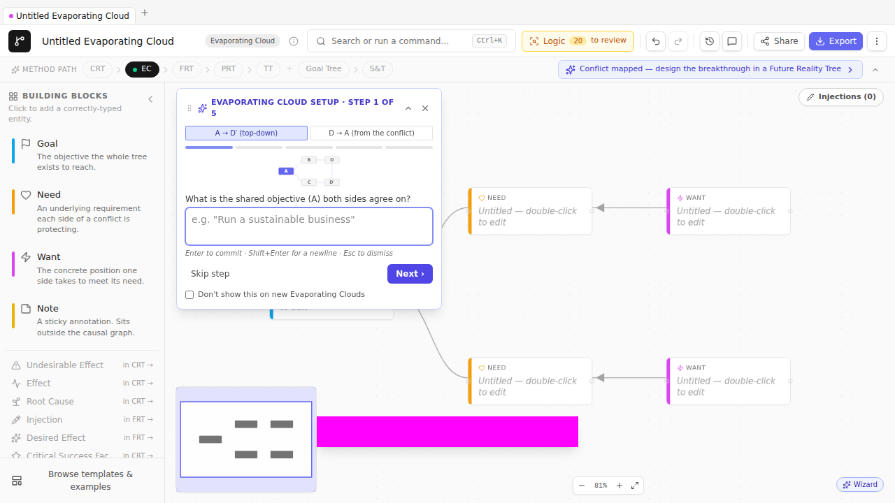

# Chapter 5 — Evaporating Cloud
### *Why are we stuck?*

> **🎯 What this process is for**
> An Evaporating Cloud (EC) reveals the *conflict* that holds a chronic problem in place. It answers: "Why hasn't this been fixed already?" The diagram is a five-box pattern showing two legitimate but opposing wants, each rooted in a real need, both subordinated to a common goal. When you draw it well, the cloud "evaporates" — you find the false assumption that made the conflict feel necessary, and the resolution emerges with it.

## The premise

If a problem has persisted in a system populated by reasonable people, **it's persisted for a reason**. Most chronic organizational problems aren't "we haven't gotten around to fixing them yet" — they're "every time we try to fix them, we create a different problem instead, and that other problem feels worse, so we revert." The thing that makes you revert is the conflict.

The Evaporating Cloud forces you to write that conflict down. Not as "Engineering vs. Product" (organizational shorthand) or "we need to choose between speed and quality" (false dichotomy in disguise), but in the specific 5-box structure that lets you see *which assumption* is making both sides feel they must hold their position.

Once the false assumption is named, the cloud evaporates. The "conflict" was never between the wants; it was between two ways of getting to the same goal under a constraint that no longer applies or never applied in the first place.

This is Goldratt at his most provocative. He claimed — and TOC practitioners since have largely confirmed — that almost every chronic conflict in an organization is *false*. The wants are real, the needs are real, the goal is shared; what's wrong is the unstated assumption that you must choose. The EC's job is to drag that assumption into the light.

## The 5-box structure

| Slot | Role | What goes here |
| --- | --- | --- |
| **A** | The common Goal | What both sides agree they're ultimately trying to achieve. |
| **B** | The Need behind want D | A legitimate prerequisite for the Goal. |
| **C** | The Need behind want D′ | A different legitimate prerequisite for the Goal. |
| **D** | The Want — one side's chosen action | What B says "to satisfy me, we should…" |
| **D′** | The Want — the other side's chosen action | What C says "to satisfy me, we should…" |

The conflict is between **D and D′**. Both can't be done simultaneously (that's the mutex). But B and C are both real needs, and A is a shared goal — so the conflict can't be resolved by picking a side. It can only be resolved by finding the assumption that makes D and D′ feel mutually exclusive, and then *not making that assumption anymore*.

Visualized, the EC looks like a flat tree on its side:

```
                ┌──────────┐
       ┌─────── │  B  Need │ ────── D  ┐
       │        └──────────┘           │
   ┌───┴───┐                          ⚡ mutex
   │ A Goal│                          │
   └───┬───┘                          │
       │        ┌──────────┐           │
       └─────── │  C  Need │ ─────── D′┘
                └──────────┘
```

Read it in either direction. **Goldratt's preferred read** is A-first (top-down): *"In order to achieve A, we must satisfy B. In order to satisfy B, we must do D. In order to achieve A, we must also satisfy C. In order to satisfy C, we must do D′. And D conflicts with D′."* The whole point of the diagram is the awkwardness of that last sentence.

## The method, neutral of tool

1. **Name the conflict in shorthand.** "We need to ship fast vs. we need to ship reliably." "Engineering wants stability vs. Product wants velocity." Whatever the room would say. This isn't the EC; this is the *cover label* for the conversation.
2. **Find D and D′ — the two wants.** Concrete. Action-shaped. "Ship the feature this sprint" / "Defer the feature one sprint." Not "be faster" / "be more careful." The wants are what people actually advocate when they argue.
3. **Find B and C — the two needs.** For each want, ask: *why do you want that?* The answer is the need. The need isn't the next action; it's the *condition the want is in service of*. B = "Maintain market position by shipping ahead of competitor X." C = "Avoid eroding customer trust through buggy releases."
4. **Find A — the shared goal.** Both B and C are conditions for what *bigger* thing? The answer is the goal. Almost always: "long-term commercial success of this product," "customer satisfaction," "team sustainability." If you can't find a shared A, the conflict is at a higher level than you've named it; back out and re-frame.
5. **Name the mutex.** Why do D and D′ conflict? Often "we only have one engineering team's time this sprint." Sometimes "you can't simultaneously have stable and not-yet-tested code in the same release."
6. **List the assumptions on each arrow.** Every necessity arrow ("B requires D") rests on assumptions. Write them down. There will be more than you expect.
7. **Find the breakable assumption.** One of those assumptions, when challenged, is false or no-longer-true. Naming it is the *injection*. The cloud evaporates: it turns out D and D′ aren't actually mutually exclusive, OR they were both wrong actions for B and C, OR the mutex isn't real.

## The worked example

We continue from [Chapter 4](04-current-reality-tree.md). The CRT identified "Support lead has no protected drafting time" as the core driver. The natural follow-up question: *why has that persisted?*

Because the support team can't actually spare anybody. Every hour the lead spends drafting is an hour fewer on the queue, the queue grows, customers complain, leadership escalates, lead is back on the queue. The system has been in this loop for months.

Underneath: a conflict. Let's draw it.

### Step 1 — Start the EC

`Cmd+K → New diagram → Evaporating Cloud`. The Creation Wizard opens at step 1, prompting for **A — the common goal**. The canvas is pre-seeded with five empty boxes in the canonical 5-box layout.



🛠 **How TP Studio helps:** The EC creation wizard is a 5-step guided dialog that fills the slots in order (A → B → C → D → D′). Each step commits the current entity live, so partial dismissals leave the canvas in a useful state. The Wizard's "from the conflict" toggle reverses the order to D-first (D → D′ → B → C → A) — useful when the cover-label conflict is what surfaced first in conversation and the goal is the thing you haven't yet articulated.

### Step 2 — Write A

The common goal. For our example: **A sustainable support function**. Type it, click Next.

The wizard auto-positions A at the canonical left-center position and gives it the sky-blue Goal stripe.

### Step 3 — Write B (need behind want D)

The wizard prompts: "What is the first need that the goal requires?" Think about who's been advocating *not* protecting drafting time. That's leadership. Why? Because they need responsiveness to keep customers retained while they're already losing some. So B = **Keep ticket queue responsive to retain at-risk customers**.

### Step 4 — Write C (need behind want D′)

"What is the second, conflicting need?" The advocate for protected drafting time would be — also the support lead, also you-the-analyst. Why? Because without the canonical answer base and the triage rubric, the team can't scale; you'll be in the same loop in six months. C = **Build durable structure (rubric + answer base) so the team scales**.

Both needs are legitimate. Both serve A.

### Step 5 — Write D

"What is the first action that satisfies need B?" The current behavior is: **Support lead stays on the queue**. That's what's been happening for the last six months.

### Step 6 — Write D′

"What is the conflicting action, satisfying need C?" **Support lead takes 2 days/week off the queue to build structure**.

Both wants are concrete actions. They conflict because the lead is one person — there isn't a both-at-once.

### Step 7 — Mark the mutex

The wizard closes; the canvas now shows the 5-box EC. Click the edge between D and D′ (if it exists; otherwise, draw it). Inspector → Mutual exclusion toggle → on. The edge turns red with a ⚡ glyph. The `ec-missing-conflict` validator stops firing.

## Step 8 — Verbalize

Open the **VerbalisationStrip** above the canvas (it's there by default on EC docs). It renders the cloud as a paragraph:

> *In order to achieve A sustainable support function, we must keep ticket queue responsive to retain at-risk customers. In order to keep ticket queue responsive to retain at-risk customers, support lead stays on the queue. In order to achieve A sustainable support function, we must also build durable structure (rubric + answer base) so the team scales. In order to build durable structure (rubric + answer base) so the team scales, support lead takes 2 days/week off the queue to build structure. And these two wants conflict.*

Read it aloud. It should sound exactly like a problem somebody at the company would describe. If it doesn't, the cloud isn't the right one.

Try the two-party variant. Document Inspector → EC Verbal Style → `twoSided`. Now the strip reads:

> *In order to achieve A sustainable support function, leadership wants to keep ticket queue responsive. To do so, they want support lead stays on the queue. In order to achieve A sustainable support function, the team wants to build durable structure. To do so, they want support lead takes 2 days/week off the queue. And these two wants conflict.*

The two-sided framing makes the political contour of the cloud visible. Useful in workshops where it matters who-said-what.

## Step 9 — Surface the assumptions

This is where the cloud evaporates.

For each of the four B→D, C→D′ necessity arrows, list assumptions. TP Studio's **AssumptionWell** in the Inspector lets you add them as first-class entities with status (`open` / `valid` / `invalid`). When an assumption is anchored to an edge, TP Studio draws a faint dashed grey line on the canvas from the assumption entity to the midpoint of the edge it pertains to — so even with multiple assumptions in play you can see at a glance which arrow each is challenging without opening the inspector.

Pick the **B → D** arrow ("To keep queue responsive, support lead must stay on the queue"). Click the edge. The AssumptionWell shows up in the Inspector. Add:

- *Only the support lead can resolve the hard tickets.*
- *Tickets sufficient to keep the queue responsive must all be resolved by humans.*
- *We can't temporarily reduce inbound ticket volume.*
- *No structural improvement could pay off within the timeframe leadership cares about.*

Pick the **C → D′** arrow. Add:

- *Building the structure requires the lead specifically — no other agent can do it.*
- *The structure must be built in dedicated blocks, not incrementally.*
- *Lead time on the structure is more than the timeline before the next renewal cycle.*

Read each one aloud. Some are clearly false; some are clearly true; one or two are *the* assumption — false but never previously named, and false-ness of which dissolves the conflict.

In our example: **"Only the support lead can resolve the hard tickets"** is the key. If two L2 agents could be trained on the hardest 20% of tickets, the lead's queue time drops, freeing the drafting time, *without* sacrificing queue responsiveness. Both wants get satisfied. The mutex was a habit, not a fact.

That false assumption is the **injection**. In the Inspector's InjectionWorkbench, mark it as `valid: false` (i.e., we've decided this assumption is wrong). Add a new entity titled **Train 2 L2 agents on the hardest 20% of ticket types** and mark it as type `Injection`. Link it to the assumption.

The cloud has evaporated.

## Step 10 — Stop

The EC is done when:

- All five slots (A / B / C / D / D′) are concrete and read naturally aloud.
- The mutex is flagged on the D ↔ D′ edge.
- Each B→D, C→D′ arrow has at least two assumptions written down.
- At least one assumption per arrow has been actively classified (valid / invalid / open).
- One assumption has emerged as **the breakable one**, with an injection drafted that resolves the conflict.
- You can describe the resolution in one sentence without rationalizing: *"Once we have two L2 agents who can handle the hard tickets, the lead can take protected drafting time without queue slippage."*

## Cloud progression — the same tool, escalating roles

Cohen frames the cloud not as a single artifact but as a *progression*. The same five-box structure does different jobs as the analysis deepens:

- A **UDE cloud** sits behind a single undesirable effect — the dilemma that keeps *this* problem alive.
- A **Consolidated cloud** merges several UDE clouds that share a shape.
- A **Core cloud** is the recurring conflict underneath many UDEs at once — the one at the base of the CRT, and the one worth breaking.

A fourth turns up constantly in practice: the **Firefighting** (Lieutenant) cloud — *patch the symptom now* vs. *stop it coming back* — the trap that keeps an organisation reacting instead of improving.

In TP Studio this is an optional **Cloud type** label (Document panel → *Cloud type*, on EC documents): Dilemma, Conflict, UDE, Consolidated, Core, or Firefighting. It's just a label — nothing about drawing or reading the cloud changes — but tagging one drops a small chip by the title so a folder of clouds reads as a progression rather than a pile. The **Pattern library…** ships a *UDE cloud*, a *Core cloud*, and a *Firefighting cloud* as pre-tagged starting points.

## The resistance cloud — why people both want and fear change

There's one cloud every change effort eventually walks into, and it's worth drawing *before* you need it. Ask a manager how people react to change and you'll hear a contradiction: employees **want** it — they're bored by routine, they chase variety, autonomy, promotion — and they **resist** it, often in the same breath ("happy and scared" about the very same promotion). The organizational psychologist Efrat Goldratt-Ashlag mapped that contradiction as a cloud, and it explains a great deal of what otherwise looks like irrational foot-dragging.

The goal both sides serve is plain: **be happy at work**. What makes the cloud bite is that this goal rests on two *different* needs, and each one pulls the opposite way on change:

- **Satisfaction** — a sense of achievement. And achievement, by definition, means pulling off something you weren't certain you could. No novelty, no challenge, no achievement. So *to get satisfaction, you have to embrace change.*
- **Security** — and here's the sharp redefinition: security is **confidence in the reliability of your own predictions**, not their content. You feel secure when you can foresee what's coming in the areas you care about. Change injects unfamiliar elements, which lowers that reliability. So *to protect security, you resist change.*

| Slot | The resistance cloud |
| --- | --- |
| **A** — goal | Be happy at work |
| **B** — need → **D** — want | Get satisfaction (a sense of achievement) → **embrace the change** |
| **C** — need → **D′** — want | Feel secure (trust my predictions hold) → **resist the change** |

The two wants are *embrace change* and *resist change* — a near-perfect mutex, and both are legitimate. That symmetry is why the same person feels both pulls at once, and why "just explain the benefits again" so reliably fails.

Two facets sharpen it:

- **The doubt sweet-spot.** Achievement needs *some* doubt, but not too much. Too little and the task is a foregone conclusion (no pride in clearing it); too much and people give up before they start. Satisfaction lives in the narrow band between "trivial" and "hopeless."
- **Security is content-blind.** You can confidently predict something *bad* and still feel secure in the prediction itself — the dread you feel then is lost *satisfaction*, not lost security. Insecurity only creeps back when the bad prediction starts undermining your *other* predictions ("if the budget's cut, can I still predict I'll keep my team?").

### Breaking it — the two channels

The payoff of drawing this cloud is that it tells you exactly where the injections live. You don't argue people out of resisting; you address the *need* their resistance is serving. There are two channels, one per need:

1. **Protect security.** Resistance is a rational defense of prediction reliability — so don't let it crash. Find the areas the person genuinely cares about, then supply the information and training that keep them able to forecast *through* the change. Someone who still feels they can predict what's happening doesn't experience the change as a threat.
2. **Offer satisfaction.** Give people a real, owning role in the change itself — a decision, a piece of the plan, something that's theirs — in an area they value. Now the change *is* the achievement, and the satisfaction need flips from fighting the change to driving it.

In TP Studio terms, each channel is an **injection** that breaks an assumption on the cloud: channel 1 attacks *"this change must reduce my ability to predict"* (the assumption under the D′→C arrow); channel 2 attacks *"this change is something done to me, not by me"* (under D→B). Open the **Pattern library…** and drop in *Resistance to change — Efrat's cloud* — it arrives with those two channels already pinned as dotted **notes** beside the needs they protect (notes are non-causal, so they don't disturb the cloud's logic or the CLR checks). List the assumptions on the two arrows, and the injections almost write themselves. From there it's the standard chain: carry each injection into an FRT and check it actually buys cooperation without spawning a negative branch — change-fatigue is the usual one.

> **💡 Why this matters in the room:** when you hit resistance, the instinct is to push harder or sell the benefits louder. This cloud says both instincts miss — resistance is defending *security* (prediction reliability), while benefits speak only to *satisfaction*. Naming which need is in play tells you which of the two channels to reach for.

## Sidebars

> **🛠 How TP Studio helps**
> - `Cmd+K → New Evaporating Cloud` → opens the **Creation Wizard** which guides A / B / C / D / D′ in order.
> - **Reading-direction toggle** in the Wizard for A-first (default) vs. D-first (when the conflict surfaced first).
> - **EC Verbal Style** toggle in the Document Inspector: `neutral` ("we must") or `twoSided` ("they want / I want") for two-party framing.
> - **Cloud type** label in the Document Inspector — tag an EC as a UDE / Consolidated / Core / Firefighting cloud (the *TP Basics* progression); a chip by the title records the role. Three pre-tagged clouds ship in the Pattern library.
> - **VerbalisationStrip** above the canvas — renders the cloud as a paragraph, updates live as you edit.
> - **AssumptionWell** in the EC inspector — first-class assumption records with `open` / `valid` / `invalid` status and links to injection entities.
> - **InjectionWorkbench** in the EC inspector — list every proposed injection with `implemented` toggles for FRT carry-forward.
> - **Mutex (⚡) edge flag** on the D ↔ D′ edge. The `ec-missing-conflict` validator fires until one such edge exists.
> - **EC Workshop Sheet PDF** — `Cmd+K → Export → EC workshop sheet` — generates a one-page PPT-style layout with the guiding questions baked in. Good for handouts.
> - **`ECReadingInstructions` strip** above the canvas — the dismissible 1/2/3 numbered hints reminding you of the reading direction. Default-hidden after Session 89; re-enable via `Toggle EC reading guide`.

> **💡 Practitioner tips**
> - **D and D′ must be actions, not states.** "We want stability" isn't a want; it's a value. The want is "we want to gate this release on a 2-week soak test." Concrete actions are what people argue about in meetings.
> - **B and C must be needs, not wants.** "Need to be fast" isn't a need; it's a paraphrase of D. The need is *what the speed is in service of* — usually a market position, a customer commitment, a financial reality.
> - **A must be genuinely shared.** If you can't find an A that both advocates would agree to, the conflict is at a higher level than you've framed it. Back out, ask "and what is *that* in service of," try again.
> - **Don't skip the assumption listing.** The temptation is to draw the 5 boxes, declare the cloud "done", and walk away. The breakable assumption hides in the assumption list, not in the boxes. The boxes are scaffolding for the listing exercise.
> - **One EC per conflict.** Don't try to fit "Engineering vs. Product vs. Customer Success" into one EC. Draw two — one for the Eng/Product conflict, one for the CS/Eng conflict — and see if they share an A.

> **⚠ Common mistakes**
> - **Picking a false A.** "Make money" is the lazy A. It's usually true but it's also true for *every* corporate conflict, which means it doesn't help you. The good A is specific enough that it could plausibly *not* hold ("be the trusted long-term partner for mid-market SaaS customers"). If the A is generic, the B and C will be generic too.
> - **Equating D with the long-term solution.** D is the *current behavior* (or the chosen-side behavior in a debated decision), not the eventual fix. The eventual fix is the *injection* you draft after dissolving the cloud. Don't shortcut.
> - **Writing wishful assumptions.** "We could just hire more people" is not an assumption that dissolves the cloud — it's a wish. Assumptions are claims you could plausibly evaluate as true/false right now.
> - **Skipping verbalisation.** If you can't read the cloud aloud and have it sound like a problem your colleagues would recognize, the cloud isn't real. Re-frame.

> **🛑 When to stop**
> - The cloud reads aloud as a real, recognizable problem.
> - Each necessity arrow has assumptions, classified.
> - One breakable assumption is named.
> - An injection exists addressing the breakable assumption.
> - The resolution sentence — "Once X, the conflict dissolves because Y" — is one sentence and stands up to a "really?" challenge.

🔁 **Chain to next:** the EC names the conflict and drafts an injection. The Future Reality Tree checks whether the injection actually delivers the desired effects without spawning new UDEs.

---

→ Continue to [Chapter 6 — Future Reality Tree](06-future-reality-tree.md)
