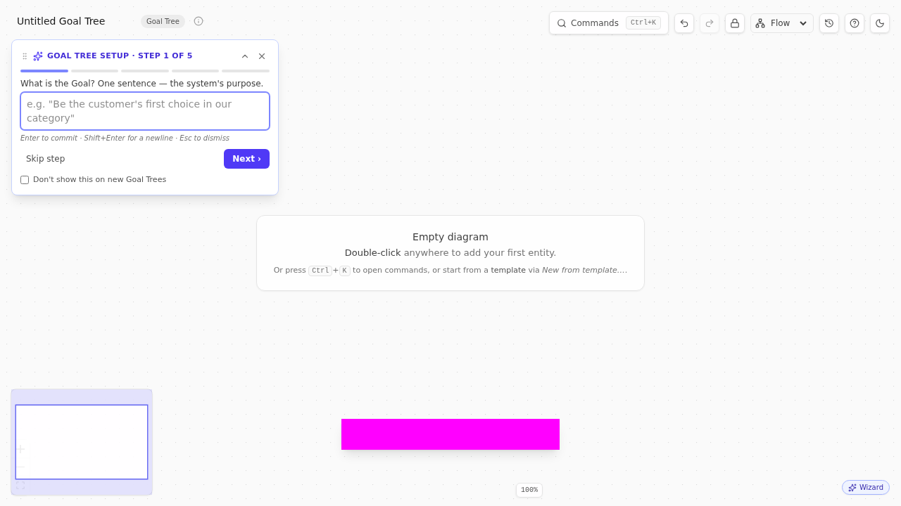

# Chapter 9 — Goal Tree
### *What does success look like?*

> **🎯 What this process is for**
> A Goal Tree (originally Intermediate Objective Map) decomposes a single Goal into Critical Success Factors (CSFs) and Necessary Conditions (NCs). It answers: "If success means X, what would have to be true?" Often drawn *before* a CRT to set the frame; sometimes drawn instead of one, when the problem is "we don't know where to start" rather than "we know things are bad."

## The premise

The CRT works bottom-up from symptoms. The Goal Tree works top-down from objective. The two are duals; you can sometimes infer one from the other.

The Goal Tree is the right starting move when:

- The organization is *planning* (annual strategy, new product launch) rather than *diagnosing* (chronic UDEs).
- You have a high-level goal and need to know what success would actually entail.
- You're trying to align stakeholders before the work starts — the Goal Tree is a shared map.

The structure: one Goal at top; 3-5 CSFs in the middle (the must-be conditions for the Goal); 5-15 NCs at the bottom (sub-conditions feeding each CSF). Each layer connects to the next with necessity edges.

## The method

1. **Write the Goal.** One sentence. Specific. Time-bounded if possible. "Hit $10M ARR by EOY 2026." "Ship Customer Portal v2 with 80%+ adoption by Q3."
2. **Brainstorm 3-5 Critical Success Factors.** "What would have to be true for the Goal to be achieved?" Each CSF should be a *condition*, not an action. "Sales pipeline is healthy" is a CSF; "Hire 3 AEs" is not (that's a NC, or a TT action).
3. **Under each CSF, list Necessary Conditions.** Sub-conditions that feed the CSF. Aim for 2-4 per CSF.
4. **Use necessity edges throughout.** "In order to achieve [Goal], we must satisfy [CSF]." "In order to satisfy [CSF], we must have [NC]."
5. **Walk the tree bottom-up.** Starting from a leaf NC, walk up to the Goal. The chain should read aloud as a coherent argument. If it doesn't, the structure is wrong.
6. **Stop when each NC is something you can plan against.** NCs that are themselves wide open (need their own Goal Tree) get bumped to the next iteration; mark them as "needs decomposition" via the Inspector's description.

## Worked example

Switch gears. Imagine you're the new GM of a B2B SaaS product line, planning your first year.

`Cmd+K → New diagram → Goal Tree`. The **Creation Wizard** opens at step 1, prompting for the Goal.

🛠 **How TP Studio helps:** The Goal Tree creation wizard mirrors the EC wizard's pattern: 5 steps, each prompting for one slot (Goal → CSF 1 → CSF 2 → CSF 3 → first NC). Each step commits live so partial walks leave the canvas useful.

Wizard step 1: **Goal**. Type **Hit $10M ARR by EOY 2026**. Next.

Step 2: **CSF 1**. *What's one thing that has to be true for that goal?* **Sales pipeline coverage of 3x quota each quarter.** Next.

Step 3: **CSF 2**. **Net retention >= 110%.** Next.

Step 4: **CSF 3**. **Two new vertical-specific use cases shipped and adopted.** Next.

Step 5: **First NC**. Pick a CSF to decompose. Take "Sales pipeline coverage of 3x quota" — what's required? **AE headcount of 8 by end of Q1.** Commit.

Wizard closes; the canvas now has a Goal Tree with one Goal, three CSFs, and one NC. Continue building manually:

- Under "Sales pipeline coverage", add NCs: **Marketing-qualified-lead flow at 200/mo by Q2**, **Pipeline-review cadence weekly with consistent definition of "qualified"**.
- Under "Net retention >= 110%", add NCs: **Customer success function staffed at 1:1.5M ARR**, **Quarterly business review cadence with strategic accounts**, **Expansion playbook documented + trained**.
- Under "Two new vertical use cases", add NCs: **Product-research effort sized at 1 PM + 1 designer for 8 weeks per vertical**, **2 design-partner contracts signed per vertical**.

You now have a Goal Tree of 1 Goal, 3 CSFs, 7 NCs. Read each chain aloud: *"In order to hit $10M ARR by EOY 2026, we must have sales pipeline coverage of 3x quota each quarter. In order to have sales pipeline coverage of 3x quota, we must have AE headcount of 8 by end of Q1."* Coherent.

## Multi-goal Goal Trees

Sometimes the strategic frame has two or three top-level goals. Conventional Goal Tree practice says no — the Goal Tree's discipline is its singular goal. But organizations do sometimes have legitimate dual top-level objectives ("Hit $10M ARR AND keep team headcount under 60").

TP Studio supports this with a *soft* warning: the `goalTree-multiple-goals` validator fires (clarity tier) when a Goal Tree has more than one Goal. The warning is dismissible. The warning's one-click action is `convert-extra-goals-to-csfs` — which downgrades every Goal except the oldest to a Critical Success Factor. That's usually the right move: the second "Goal" is actually a constraint on the first.

If you genuinely need two Goals, dismiss the warning and proceed. Just be honest about whether the constraint framing fits better.

## Sidebars

> **🛠 How TP Studio helps**
> - `Cmd+K → New Goal Tree` → opens the **Creation Wizard** (Goal → CSF1 → CSF2 → CSF3 → first NC, 5 steps).
> - **`goal`** entity (sky stripe), **`criticalSuccessFactor`** (teal stripe), **`necessaryCondition`** (lime stripe) — Goal-Tree-specific palette.
> - **`add-nc-child`** verb: select a CSF or NC, single-entity toolbar → Add NC. Mirrors the wizard's step 4 logic for adding more NCs after the wizard closes.
> - **`promote-to-goal`** verb: select an entity that isn't yet a Goal, toolbar → Promote to Goal. Useful when an NC turns out to be the real strategic objective.
> - **`goalTree-multiple-goals`** validator with the **`convert-extra-goals-to-csfs`** one-click action.
> - **Reasoning narrative export** renders the Goal Tree as a top-down necessity argument suitable for stakeholder packs.

> **💡 Practitioner tips**
> - **Time-bound the Goal.** "Hit $10M ARR" is weaker than "Hit $10M ARR by EOY 2026." The time bound is what makes the tree falsifiable.
> - **CSFs are conditions, not projects.** "Healthy pipeline" is a condition. "Run the pipeline-improvement project" is not.
> - **Goal Tree first, CRT second** when you're planning. **CRT first, Goal Tree implicit** when you're diagnosing existing pain. Both flows are valid.
> - **Re-draw the Goal Tree annually.** Last year's strategic frame ages out. The Goal Tree is meant to be a living artifact; if it's been static for two years, you've stopped using it.

> **⚠ Common mistakes**
> - **Too many CSFs.** Three is a sweet spot; five is okay; seven means you haven't decided what matters. The CSF layer is *the strategic shape* of the goal; it should be small enough to remember.
> - **CSFs and NCs at the wrong level.** "Increase MRR 10% MoM" is too granular for a CSF (that's a metric to track, not a condition to have). "Have a pipeline" is too vague for an NC. Calibrate; rewrite.
> - **Confusing Goal Tree with the to-do list.** The Goal Tree is *what would be true*, not *what would be done*. Actions belong in the PRT/TT downstream.

> **🛑 When to stop**
> - One Goal, time-bounded, specific.
> - 3-5 CSFs, each a condition.
> - 2-4 NCs per CSF, each something you can plan against.
> - Read-aloud passes at every chain.
> - You can describe the strategic frame in one sentence using the Goal-Tree vocabulary.

🔁 **Chain to next:** the Goal Tree is the strategic frame. The S&T tree is the *deployment* of that frame across the organization, one operational level at a time.

---

→ Continue to [Chapter 10 — Strategy & Tactics Tree](10-strategy-and-tactics-tree.md)
