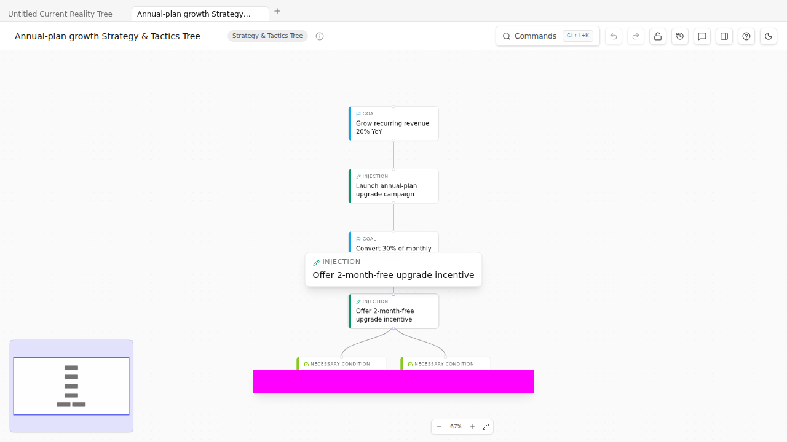

# Chapter 10 — Strategy & Tactics Tree
### *Deploying operationally*

> **🎯 What this process is for**
> A Strategy & Tactics Tree (S&T) is the deployment-grade decomposition of a strategy across an organization, from CEO-level down to individual contributor. Each node is a 5-facet card holding Necessary Assumption (why this matters), Strategy (what), Parallel Assumption (why this specific approach), Tactic (how), and Sufficiency Assumption (why this is enough). Used for cross-functional rollouts, big strategic programs, and as the working document for a TOC-style strategic deployment.

## The premise

The Goal Tree is *what success looks like*. The S&T tree is *what each person does on Monday morning when we deploy the strategy across 30 teams*.

S&T came late to the TOC tradition (Goldratt formalized it in the 2000s) and is the most operationally specific of the thinking processes. Each node carries its own self-contained micro-argument across five facets. The facet names below are Goldratt's; the one-line characterizations are how this book reads them in practice:

| Facet | A reading |
| --- | --- |
| **Necessary Assumption** (NA) | The world-state above us has changed enough that *not* acting at this layer has become unacceptable. Captures the trigger handed down from the parent node. |
| **Strategy** | A statement of the result we are committing to deliver at this layer — what good looks like, not how we get there. Phrased as an outcome, not an action. |
| **Parallel Assumption** (PA) | Of the strategies that *could* respond to NA, why this one. Captures the comparative choice — the alternatives we considered and what made this one the right pick. |
| **Tactic** | The concrete things people will do. Verbs, not aspirations. Granular enough that you can tell whether they happened. |
| **Sufficiency Assumption** (SA) | If we complete the tactic, the strategy is fulfilled. Captures the bet that Tactic → Strategy is a real causal chain, not a hopeful one. |

A complete S&T tree at organizational scale might be 40-100 nodes, decomposed across 4-6 levels. Few teams ever build one. The skill matters mostly when you're either *running* a TOC-style deployment or *evaluating one someone else built*.

## The method

1. **Top-level S&T node:** the program goal. Fill all five facets.
2. **Decompose into 3-5 sub-strategies.** Each child S&T node represents a strategy that *contributes to fulfilling* the parent's Tactic.
3. **At each level, every facet is filled.** Empty facets are CLR violations (the `st-tactic-assumptions` validator flags missing facets per node).
4. **Continue down until the leaf tactic is operational** — a thing a named team can plan against.

## Worked example (sketch)

Open the example: `Cmd+K → Load example → Strategy & Tactics Tree`. TP Studio ships a 2-level S&T example that demonstrates the 5-facet rendering.

A short example tree might look like:

- **Top node:** Strategy = "Achieve 30% growth in customer base by EOY 2026" with the 4 surrounding facets.
- **Child 1:** Strategy = "Expand into healthcare vertical." NA = "Healthcare is underserved relative to TAM." PA = "Healthcare vertical chosen over EdTech because compliance moat is more durable." Tactic = "Build 2 healthcare-specific compliance features, hire 1 vertical specialist." SA = "Healthcare-specific feature set + named specialist convert 3 healthcare design partners → 12 paid → 60 paid within 18 months."
- **Child 2:** "Strengthen referral motion." (Each facet filled similarly.)
- **Child 3:** "Optimize self-serve onboarding."

Each child is a fully-formed micro-argument. Disagreements about deployment surface at the facet level: "I disagree with our PA — I think the right vertical is FinTech." That's a productive disagreement; it points at one specific facet on one specific node, not vague "I don't like the strategy."

## Sidebars

> **🛠 How TP Studio helps**
> - `Cmd+K → New Strategy & Tactics Tree`.
> - **5-facet rendering**: an `injection` entity in an `'st'` diagram with the reserved `stStrategy` / `stNecessaryAssumption` / `stParallelAssumption` / `stSufficiencyAssumption` attributes renders as a tall 5-row card with the four facets above the title. Click any row to inline-edit.
> - **`st-tactic-assumptions` validator** (CLR sufficiency tier) flags any tactic with fewer than three necessary-condition feeders. Useful in real S&T trees where each tactic should rest on several supporting NCs.
> - **6-step method checklist** in the Document Inspector — the canonical S&T sequence (write top-level strategy → fill all 4 facets → decompose into children → fill each child's facets → audit completeness → present).

> **💡 Practitioner tips**
> - **Write all 5 facets before moving on.** A partially-facetted node is worse than no node — it implies completeness without delivering it.
> - **NA and SA are about argumentation, not summary.** "NA: It's important to grow" is useless. "NA: Without 30% growth, we don't make Series C metrics, and Series C is needed by Q3 2027" is useful.
> - **The PA is where alternatives go to die.** A good PA reads: "Strategy X chosen over Strategy Y because [reason], and over Strategy Z because [reason]." If you've never written that explicitly, you haven't seriously considered alternatives.

> **⚠ Common mistakes**
> - **Skipping facets to "get to the point."** The facets *are* the point. Without them the S&T tree is just a project plan.
> - **Treating it as a Gantt chart with extra steps.** S&T isn't sequencing; it's argument structure. Sequencing lives in PRT/TT.

> **🛑 When to stop**
> - Every node has all five facets filled.
> - Leaf tactics are operational (team-can-plan-against).
> - Each parent's tactic is supported by ≥3 child strategies (the `st-tactic-assumptions` validator stops firing).
> - You can hand the tree to a deployment lead and they can build a rollout calendar from it without coming back with structural questions.

🔁 **Chain to next:** the seven structured TPs (CRT, EC, FRT, PRT, TT, Goal Tree, S&T) are the canonical kit. The freeform diagram is for *when the structure doesn't fit*.

---

→ Continue to [Chapter 11 — Freeform diagrams](11-freeform-diagrams.md)
