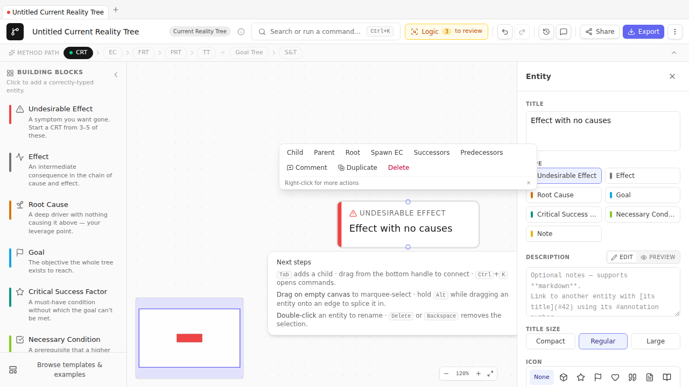

# Chapter 13 — The CLR — your validation conscience

> *The Categories of Legitimate Reservation are the discipline checks Goldratt taught for evaluating a causal claim. TP Studio surfaces them automatically as warnings. They are reservations a thoughtful colleague would raise. They are not errors.*

## The six categories

Goldratt named six. The operationalization into validator-style rules that practitioner tools surface — what TP Studio does — owes a debt to William Dettmer's *The Logical Thinking Process* (2007), which formalized the categories for everyday use. Listed here in order of where they typically bite first as you draft a diagram:

1. **Clarity.** The reader can't tell what you mean. An empty title, a verb-less noun phrase, an abstraction so generic it could be glued to any tree.
2. **Entity existence.** You're asserting a state of the world. Is that state actually observable? "Engineering velocity is dropping" lives or dies on whether you can show it.
3. **Cause-effect existence.** The two entities exist; you've drawn an arrow between them; does the arrow correspond to anything in reality? "Engineering velocity dropped because Mercury went retrograde" fails here, however clean the diagram looks.
4. **Cause sufficiency.** This cause alone — without anything else lined up alongside it — produces this effect? Or does the effect require a co-cause that you haven't drawn? The category where AND-groups get born.
5. **Additional cause.** Is there a *different* cause that would also produce this effect? Two roads to the same destination — modelled with OR-junctors, often missed by single-path thinking.
6. **Cause-effect reversal.** Run the same arrow the other way around; does it still make sense? If the answer is "actually, maybe even more sense," you've inverted the causal direction. The classic trap inside a B2B sales org: "deals are slow because morale is low" — until someone points out the direction is "morale is low because deals are slow."

TP Studio's validator system implements rules in each of these tiers. The `Warnings` list in the Inspector surfaces them per-entity / per-edge. The `Start CLR walkthrough` palette command iterates them one at a time.

## How TP Studio surfaces them

Each validator carries:

- A **tier**: `clarity`, `sufficiency`, `causality`, or `predictedEffect`. The tier governs the warning's color and the order it appears in the walkthrough wizard.
- A **diagram-type scope**: most rules fire only on specific diagram types (e.g., `ec-missing-conflict` is EC-only; `complete-step` is TT-only).
- A **trigger predicate**: a pure function over the doc that returns the set of entities/edges to fire on.
- Optionally, a **one-click action**: a `WARNING_ACTIONS` registry entry that resolves the warning. Example: the `convert-extra-goals-to-csfs` action on the `goalTree-multiple-goals` warning.

The full list is in [Appendix C](appendix-c-clr-rules.md).

## Reading warnings

Click any entity with an open warning. The Inspector's Warnings section lists them as bullet items with the tier color (yellow for `clarity`, amber for `sufficiency`, orange for `causality`, red for `predictedEffect`). Each warning has a one-line explanation; some carry a "Fix" button when a one-click action is available.

## The walkthrough

`Cmd+K → Start CLR walkthrough` opens a modal that iterates every open warning, one at a time, with **Resolve** / **Open in inspector** / **Dismiss** actions. Useful for ratcheting through a complex diagram's warnings without manually clicking each entity.

The walkthrough is scope-limited to *open* warnings — once you dismiss a warning, it doesn't reappear unless the underlying condition changes. That makes the walkthrough a *clearing* gesture: run it before declaring a diagram done; if it's empty, you've considered every reservation.

## Dismissing warnings

Two ways to dismiss:

- **Resolve** — fix the underlying condition. The warning stops firing on its own.
- **Dismiss with explanation** — keep the condition, but record in the entity's `description` *why* you're accepting the reservation. The walkthrough stops surfacing this one. The audit trail lives in the description.

Don't dismiss without writing the explanation. A dismissed warning with no rationale is a debt you'll pay later when someone reads the diagram and asks "why does this UDE have no causes?"

## Sidebars

> **🛠 How TP Studio helps**
> - **Per-entity / per-edge Warnings list** in the Inspector.
> - **`Cmd+K → Start CLR walkthrough`** — modal that iterates open warnings.
> - **One-click actions** on a subset of warnings (e.g., `convert-extra-goals-to-csfs`).
> - **Tier-color coding** in the warnings list: clarity (yellow) → sufficiency (amber) → causality (orange) → predicted-effect (red).
> - **Dismissibility** — every warning can be dismissed; dismissals don't recur until the underlying state changes.

> **💡 Practitioner tips**
> - **Walk-through *before* you present.** A reader will hit the warnings if you don't.
> - **Treat warnings as suggestions, not commands.** The CLR is a discipline framework; it doesn't always know your context. Apply judgment.
> - **The clarity tier is the most forgiving and most pedagogical.** If you're learning, work the clarity warnings until they're empty before tackling the higher tiers.

> **⚠ Common mistakes**
> - **Dismissing without explanation.** Each dismissal is a future-self bug if the rationale isn't recorded.
> - **Treating all warnings as equal.** The four tiers are deliberately ordered. A `predictedEffect` warning is structural; a `clarity` warning might just be a typo.

🔁 **Chain to next:** the CLR is the validation conscience. Iteration is the *building* conscience — revisions, branches, side-by-side compare are how a diagram improves over time.

---

→ Continue to [Chapter 14 — Iteration](14-iteration-revisions-branches.md)
