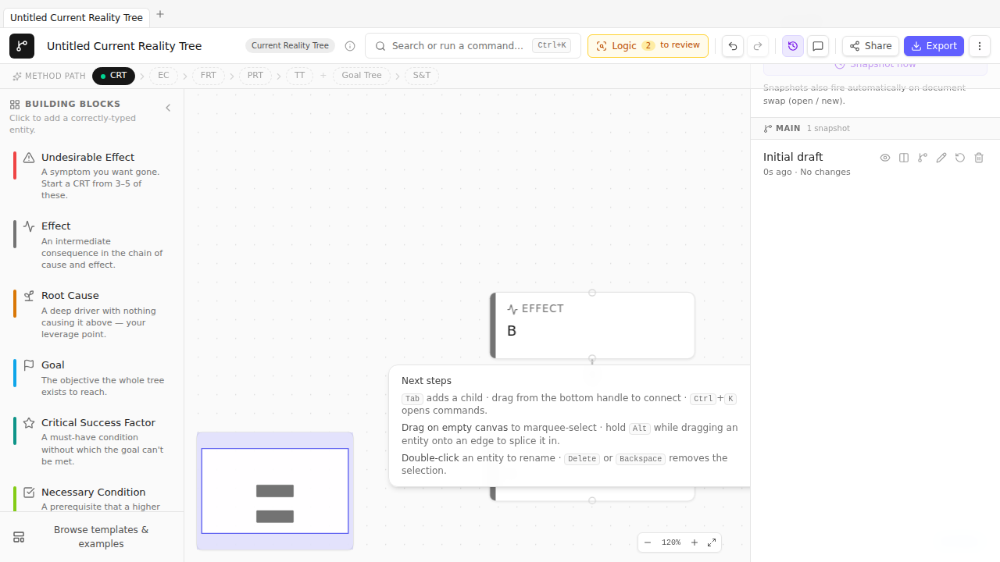

# Chapter 14 — Iteration — revisions, branches, compare

> *A CRT done well is the diagram you have on Friday, not the diagram you drew on Monday. The H1–H4 features make iteration cheap, which is why the diagram you have on Friday is better.*

## Capturing snapshots

A **revision** is a point-in-time snapshot of the document. TP Studio stores up to 50 revisions per document in `localStorage`, indexed by id with optional labels.

Capture one any time with `Cmd+K → Capture snapshot`. The palette command prompts for a label — give it one. "Before injecting the resolution." "After CRT review with Maria." "Pre-Negative-Branch hunt." The labels are how Future You will find this revision when the History panel has 30 of them.

Automatic snapshots also fire when:

- A document is loaded via Import / Load example / New from template (the prior doc is auto-snapped).
- A "safety snapshot" is captured before a Restore operation (so you can undo the undo).

## The History Panel

TopBar → History button (or `Cmd+K → Open history panel`) opens a slide-in panel listing all revisions:

Each row shows the label, the timestamp, and three actions: **Restore** (replace the live doc with this revision), **Compare** (open the side-by-side dialog), and **Branch from here** (give this revision a `branchName`).

The panel groups revisions by branch. The default branch is `Main`. Branching is the way to explore alternatives — "what if we drop the L2 training and just hire one senior?" — without committing your speculation to the canonical history.

## Branching

`Cmd+K → Branch from current revision` (or from a revision row in the History panel) prompts for a branch name. The branch becomes a labeled lineage; subsequent snapshots after a restore-from-this-branch belong to the new branch.

TP Studio's branch model is intentionally lightweight. It's not git. There's no merge; there's no checkout. A branch is just a label attached to a revision (and its descendants) so the History panel can group them visually. The point is exploration — "I want to keep my current line of analysis but also try this other thing."

🛠 **When to branch:** before a structurally risky edit ("I'm about to delete five entities and re-draw the cause chain"), before exploring a Negative Branch hunt that you might roll back, before presenting to stakeholders (so the live version is "what we showed them" and your subsequent edits don't change it retroactively).

## Side-by-side compare

The H4 feature. Select a revision in the History panel → Compare. A fullscreen modal opens with two panels: snapshot on the left, live on the right.

Entities render as absolute-positioned cards; edges as SVG lines between them. Added entities are emerald-tinted; changed entities are amber-tinted; removed entities appear in the snapshot panel only (not in the live one).

Useful when you've done significant edits and want to see *exactly* what changed structurally. Common workflow: capture a snapshot, do 30 minutes of edits, side-by-side compare to verify the diff matches your intent.

## Visual diff overlay (compare mode)

Lighter than the side-by-side dialog. `Cmd+K → Compare with revision…` picks a revision and overlays a per-entity ring tint on the live canvas:

- Emerald ring = added since this revision.
- Amber ring = changed since this revision.

A banner at the top tells you what revision you're comparing against. Esc exits compare mode.

Useful for "I want to know what's new in the live doc without leaving the canvas." The side-by-side dialog gives you more detail; this overlay is faster.

## Sidebars

> **🛠 How TP Studio helps**
> - `Cmd+K → Capture snapshot` (with optional label).
> - **History panel** slide-in (TopBar button or `Cmd+K → Open history panel`).
> - **Branch from here** action on any revision row.
> - **Side-by-side compare** dialog.
> - **Compare mode overlay** on the live canvas with per-entity diff tinting.
> - **Safety snapshot on restore** — you can undo a restore.

> **💡 Practitioner tips**
> - **Label snapshots when you take them.** A timestamp alone is meaningless after a week.
> - **Snapshot before risky edits.** Cheaper than reconstructing.
> - **Branch before exploring.** "Try this thing" is much cheaper psychologically when you know you can return to the prior branch.
> - **Use side-by-side compare before presenting.** Comparing the "what stakeholders saw" snapshot to the live doc surfaces the changes you want to talk about.

> **⚠ Common mistakes**
> - **Snapshot drift.** Capturing 50 unlabeled snapshots; later not knowing which is which. Label.
> - **Treating the history as version control.** It's not. There's no commit message, no diff in textual form, no merge. It's a *time machine for your canvas*, not git.

🔁 **Chain to next:** Part 3 is done — you have groups, the CLR, and iteration. Part 4 takes the diagram out of your private workspace and into the world: verbalisation, sharing, workshops.

---

→ Continue to [Chapter 15 — Verbalisation and walkthroughs](15-verbalisation-walkthroughs.md)
