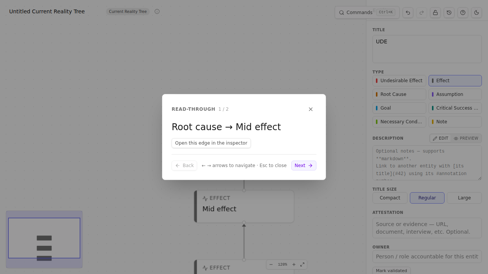

# Chapter 15 — Verbalisation and walkthroughs

> *Verbalisation is the TOC tradition's name for "read it aloud, edge by edge, slowly." It is the single most underrated discipline in TOC and the source of most of the "wait — actually I had this wrong" moments. TP Studio supports it three ways.*

## Why aloud

When you read a diagram silently, your brain auto-completes. The arrow you drew Monday says what you *thought* it said when you drew it. Three days later you skim it and your skimming-brain confirms the original intent — even when the entity titles you wrote on Tuesday subtly broke the logic.

Reading aloud bypasses the autocompletion. The mouth and ear catch what the eye misses. The sentence "Because we ship slowly, customers churn" is structurally fine; the sentence "Because we ship slowly, our quarterly earnings" sounds incomplete in a way you'd notice immediately spoken but not noticed reading.

Goldratt and the practitioners who followed him (Dettmer especially) treat verbalisation as discipline, not affectation. You don't whisper through it; you actually say the sentences. In a workshop, the lead asks one participant to read; everyone else listens.

## TP Studio's three supports

### 1. The Read-through overlay

`Cmd+K → Start read-through` opens a fullscreen overlay that walks every structural edge in topological order. Each step presents one sentence — *"Because [source], [target]"* — with arrow / space navigation between sentences.

Use it solo before you present. Use it with a participant in a workshop. The discipline imposes itself — you can't skim; the overlay shows one sentence at a time.

### 2. The VerbalisationStrip (EC-only)

For Evaporating Clouds, the canonical reading is a single paragraph. The VerbalisationStrip renders it above the canvas, updating live as you edit. Settings → EC Verbal Style toggles between `neutral` ("we must") and `twoSided` ("they want / I want") framings.

Read the strip aloud after every structural edit on an EC. The "this sounds wrong" reaction is the most reliable validator the EC has.

### 3. The reasoning narrative / outline exports

Two Markdown exports under `Cmd+K → Export → Markup → Reasoning`:

| Export | Shape | Use case |
| --- | --- | --- |
| **Reasoning narrative** | Sentence-per-edge, prose paragraphs by chain | Pastes into a doc or a strategy brief; reads as argument prose. |
| **Reasoning outline** | Headings = terminal effects; nested bullets = cause chains | Outline form (like OPML); good for review meetings. |

Both carry preambles: title, System Scope (if filled), EC conflict statement (on EC docs), and a per-diagram-type appendix (Core Driver for CRTs, triple-form for TTs).

The exports are how verbalisation leaves your screen. The audience that didn't sit through the workshop reads the narrative; they hear what you would have said.

## Workshop technique — "read it back to me"

Three-person variant useful for workshop facilitation:

1. **Builder** drives the canvas, says nothing aloud.
2. **Verbaliser** reads each new edge aloud as it's drawn: *"You're claiming because A, B?"*
3. **Listener** says "okay" or "wait — really?"

The verbaliser is the discipline; the listener is the CLR. The builder is the analyst. Switching seats every 15 minutes spreads the discomfort of being verbaliser around the room.

## Sidebars

> **🛠 How TP Studio helps**
> - **`Cmd+K → Start read-through`** — fullscreen verbalisation overlay.
> - **VerbalisationStrip** on EC canvas — live paragraph rendering.
> - **`Cmd+K → Start CLR walkthrough`** — partner discipline; iterates open warnings.
> - **Reasoning narrative export** — Markdown paragraph form per chain.
> - **Reasoning outline export** — Markdown nested-list form.
> - **EC Verbal Style toggle** — neutral vs. two-sided framing.

> **💡 Practitioner tips**
> - **Aloud means aloud.** "I read it in my head" isn't verbalising.
> - **Read in the morning.** Tired brain skims worse than fresh brain. Don't verbalise after lunch.
> - **Capture a snapshot before you re-read.** When verbalising surfaces a structural problem, you'll be editing in five minutes. A pre-read snapshot is the baseline you'll compare against later.

> **⚠ Common mistakes**
> - **Skipping verbalisation because the diagram "looks right."** Looking right and reading right are different. The diagram that looks right but reads wrong is the most common bug.
> - **Speed-reading the strip.** Slow down. The point of aloud is the *time* spent on each sentence.

🔁 **Chain to next:** verbalised diagrams want to be shared. Next chapter covers exports, share links, prints.

---

→ Continue to [Chapter 16 — Sharing your work](16-sharing-your-work.md)
