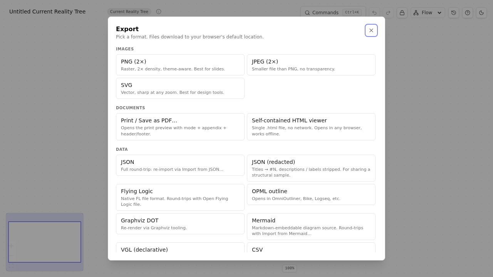

# Chapter 16 — Sharing your work

> *TP Studio is local-first; nothing leaves your browser unless you choose to send it. The Export picker is the single doorway out. This chapter is the doorway's map.*

## Three modes of sharing

| Mode | Best for | Tradeoff |
| --- | --- | --- |
| **Standalone HTML viewer** | Sharing the full diagram with someone who doesn't have TP Studio. Double-click to open. | Single self-contained file. Read-only. Heaviest in size. |
| **Read-only share link** | Quick share via Slack / email / chat. URL fragment encodes the full doc. | URL gets long for big diagrams. Receiver opens in their own TP Studio session (Browse Lock auto-engages). |
| **Image / vector export** | Pasting into a deck, doc, or wiki. | Static. Lossy if PNG; vector if SVG/PDF. No interactivity. |

Pick by the audience. Engineers and analysts: share link. Slide deck and stakeholder pack: vector PDF. The non-technical "open this with the file" audience: standalone HTML viewer.

## The Export Picker

`Cmd+K → Export` opens the unified picker:

Three groups:

### Images

- **PNG** — high-DPI raster, theme-aware. 2× density by default. Good for ad-hoc paste.
- **JPEG** — lossy raster. Smaller files. Web-friendly.
- **SVG** — vector. Sharp at any zoom. Importable into Figma, Illustrator, etc.
- **PDF** — true vector PDF via jspdf + svg2pdf. Paginated if the diagram exceeds page-height. Optional annotation appendix.
- **Print / Save as PDF…** — opens the **Print Preview Dialog** with mode picker (Standard / Workshop / Ink-saving), annotation appendix toggle, and header/footer merge fields. The browser print dialog opens after.

The PDF route is the most polished. Use Print Preview for the layout knobs; use the direct PDF export for unattended/scripted use.

### Markup

- **Markdown** — outline form. Paste into docs, GitHub, Notion.
- **OPML** — outline form. OmniOutliner, Bike, Logseq.
- **DOT (Graphviz)** — for tooling pipelines.
- **Mermaid** — both export and import; round-trips with the Mermaid live editor.
- **VGL (declarative)** — Flying Logic-flavored declarative text.
- **Flying Logic XML** — round-trips with Flying Logic.

### Reasoning + Workshop

- **Reasoning narrative** — Markdown, sentence-per-edge prose. See [Chapter 15](15-verbalisation-walkthroughs.md).
- **Reasoning outline** — Markdown, nested-list form.
- **CSV** — entities + edges + groups in one RFC-4180 file.
- **Annotations only (.md / .txt)** — just the description bodies, for content-review workflows.
- **EC Workshop Sheet (PDF)** — one-page PPT-style layout with guiding questions, EC-only.
- **Standalone HTML viewer** — single self-contained file.
- **JSON** — canonical schema-versioned export; the most lossless format.
- **Redacted JSON** — content-stripped JSON. Same structure, generic titles. Useful for sharing the *shape* of an analysis without the confidential content.

## Share links

`Cmd+K → Copy read-only share link`. Generates a URL that:

- Has the format `https://your-tp-studio-host/#!share=<base64-gzipped-json>`.
- Encodes the entire current document in the fragment.
- Never reaches a server — the fragment after `#` is client-side-only.
- On the receiver: TP Studio detects the `#!share=` fragment on boot, decodes, loads the doc, and **engages Browse Lock automatically** so the receiver can't accidentally commit edits to a foreign document.

Trade-offs:

- **Size**: a typical 20-entity CRT lands under 2 KB compressed; a 200-entity Goal Tree might push past 8 KB and trip length limits in some email clients. A toast warns when the link exceeds ~4 KB.
- **Visibility**: the fragment is in the receiver's browser history. Treat shared diagrams as "public enough to email" — same threat model as JSON export.
- **Hostility defense**: Session 98 added a 5 MB ceiling on the decompressed payload to defend against gzip bombs.

## Print preview

`Cmd+K → Print / Save as PDF`. Opens the **Print Preview Dialog** with:

- **Mode picker:** Standard (full color), Workshop (bold high-contrast), Ink-saving (no fills, lighter strokes). Each renders the same diagram differently for context.
- **Annotation appendix toggle:** include an addendum listing every entity description as a numbered footnote.
- **Header / footer:** plain text + `{title}` / `{pageNumber}` / `{pageCount}` merge fields.
- **Selection-only toggle:** print only the currently-selected entities (renders with non-selected nodes set to `visibility: hidden` so the canvas geometry stays intact).

Browser print dialog opens once you click Print.

## The standalone HTML viewer

The most underrated export. `Cmd+K → Export → Standalone HTML viewer` generates a single `.html` file that contains:

- The full TP Studio canvas runtime, bundled.
- The current document, base64-embedded in a `<script type="application/json">` tag.
- The current theme.

Double-clicking the file opens it in any browser. No network calls. No JavaScript dependencies. Read-only — the viewer has no edit gestures wired up.

Perfect for: airgapped audiences, security-conscious recipients, slides with embedded HTML, archival.

## Sidebars

> **🛠 How TP Studio helps**
> - **`Cmd+K → Export`** — unified Export Picker.
> - **`Cmd+K → Copy read-only share link`** — fragment-encoded URL share.
> - **`Cmd+K → Print / Save as PDF`** — Print Preview Dialog.
> - **Standalone HTML viewer** — self-contained share artifact.
> - **EC Workshop Sheet PDF** — one-page handout for EC workshops.
> - **Browse Lock auto-engages on share-link load** — receivers can't accidentally edit.

> **💡 Practitioner tips**
> - **Capture a snapshot before exporting for stakeholders.** "What I showed them on Tuesday" is a revision you'll want later.
> - **PDF for static audiences, share link for interactive ones.** Stakeholders click PDFs; analysts click links.
> - **Use redacted JSON when sharing the shape of an analysis.** "Here's our diagnostic shape, with anonymized content" is a real workflow.
> - **The EC Workshop Sheet is great handout material.** Print one per participant.

> **⚠ Common mistakes**
> - **Sharing the wrong revision.** When you send a link, the link encodes the *current* doc state — not whichever snapshot you thought it would be. Capture + restore the right revision first.
> - **Forgetting Browse Lock when demoing locally.** Click the lock icon before screen-sharing. Otherwise an errant double-click during the demo creates a stray entity.

🔁 **Chain to next:** sharing is the asynchronous mode. Workshops are the synchronous one. Next chapter covers the latter.

---

→ Continue to [Chapter 17 — Workshops with TP Studio](17-workshops-with-tp-studio.md)
